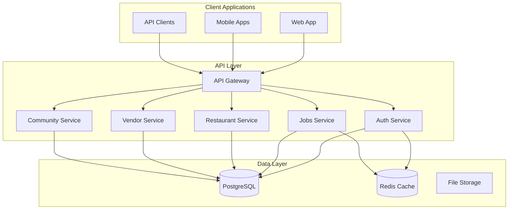

# RestaurantHub Documentation

Welcome to the comprehensive documentation for the RestaurantHub platform - a complete B2B/B2C SaaS solution for the restaurant industry.

## 📋 Documentation Overview

This documentation covers all aspects of the RestaurantHub platform, from API integration to user guides and system architecture. Whether you're a developer, restaurant owner, employee, vendor, or administrator, you'll find the resources you need here.

## 🚀 Quick Start

### For Developers
- **[API Documentation](./api/README.md)** - Complete API reference with examples
- **[OpenAPI Specification](./api/openapi-specification.yaml)** - Interactive API documentation
- **[Developer Integration Guide](./integration/developer-guide.md)** - SDKs, code samples, and best practices
- **[Authentication Guide](./security/authentication-guide.md)** - Security implementation details

### For Restaurant Owners
- **[Getting Started Guide](./user-guides/restaurant-owners/getting-started.md)** - Set up your restaurant and start hiring
- **[Job Management](./user-guides/restaurant-owners/job-management.md)** - Post jobs and manage applications
- **[Employee Management](./user-guides/restaurant-owners/employee-management.md)** - Team management tools

### For Employees
- **[Employee Guide](./user-guides/employees/getting-started.md)** - Find and apply for restaurant jobs
- **[Profile Management](./user-guides/employees/profile-management.md)** - Build your professional profile
- **[Job Search Tips](./user-guides/employees/job-search.md)** - Maximize your job search success

### For Vendors
- **[Vendor Onboarding](./user-guides/vendors/getting-started.md)** - Start selling to restaurants
- **[Product Management](./user-guides/vendors/product-management.md)** - Manage your product catalog
- **[Order Processing](./user-guides/vendors/order-processing.md)** - Handle restaurant orders

### For Administrators
- **[Admin Panel Guide](./user-guides/administrators/admin-panel.md)** - Platform administration
- **[User Management](./user-guides/administrators/user-management.md)** - Manage platform users
- **[System Monitoring](./user-guides/administrators/system-monitoring.md)** - Monitor platform health

## 📖 Complete Documentation Index

### API Documentation
| Document | Description | Audience |
|----------|-------------|----------|
| [API Overview](./api/README.md) | Complete API documentation with examples | Developers |
| [OpenAPI Specification](./api/openapi-specification.yaml) | Machine-readable API specification | Developers, Tools |
| [Authentication Guide](./security/authentication-guide.md) | JWT tokens, security, and RBAC | Developers |

### Integration Guides
| Document | Description | Audience |
|----------|-------------|----------|
| [Developer Guide](./integration/developer-guide.md) | SDKs, code samples, webhooks | Developers |
| [Mobile Integration](./integration/mobile-guide.md) | React Native and Flutter examples | Mobile Developers |
| [Web Integration](./integration/web-guide.md) | React, Vue, Angular examples | Frontend Developers |

### Architecture Documentation
| Document | Description | Audience |
|----------|-------------|----------|
| [System Overview](./architecture/system-overview.md) | Complete architecture documentation | Developers, DevOps |
| [Database Schema](./database/schema-documentation.md) | Database design and relationships | Developers, DBAs |
| [Security Architecture](./security/security-overview.md) | Security design and implementation | Security Engineers |

### User Guides
| Document | Description | Audience |
|----------|-------------|----------|
| [User Guide Overview](./user-guides/README.md) | Platform overview for all users | All Users |
| [Restaurant Owners](./user-guides/restaurant-owners/) | Complete restaurant management guide | Restaurant Owners |
| [Employees](./user-guides/employees/) | Job search and career development | Job Seekers |
| [Vendors](./user-guides/vendors/) | B2B marketplace and selling | Suppliers |
| [Administrators](./user-guides/administrators/) | Platform administration | Admins |

### Deployment & Operations
| Document | Description | Audience |
|----------|-------------|----------|
| [Deployment Guide](./deployment/deployment-guide.md) | Production deployment instructions | DevOps |
| [Monitoring Setup](./operations/monitoring-guide.md) | System monitoring and alerting | DevOps |
| [Backup & Recovery](./operations/backup-recovery.md) | Data backup and disaster recovery | DBAs, DevOps |

## 🏗️ Platform Architecture

### System Components



### Technology Stack

#### Backend
- **Framework**: NestJS with TypeScript
- **Database**: PostgreSQL with Prisma ORM
- **Cache**: Redis for sessions and caching
- **Authentication**: JWT with role-based access control
- **File Storage**: Cloudinary for images and documents

#### Frontend
- **Web**: Next.js with React and TypeScript
- **Mobile**: React Native with Expo
- **Styling**: Tailwind CSS
- **State Management**: React Query for server state

#### Infrastructure
- **Containerization**: Docker and Docker Compose
- **Orchestration**: Kubernetes (production)
- **CI/CD**: GitHub Actions
- **Monitoring**: Prometheus and Grafana
- **Logging**: Winston with structured logging

## 🔐 Security Features

### Authentication & Authorization
- **Multi-role system**: Admin, Restaurant, Employee, Vendor
- **JWT-based authentication** with refresh token rotation
- **Two-factor authentication** support (planned)
- **Role-based access control** (RBAC)
- **Account verification** with document upload

### Data Protection
- **Encryption**: AES-256 for sensitive data
- **HTTPS**: All communications encrypted in transit
- **GDPR compliance**: Data export and deletion
- **Audit logging**: Complete activity tracking
- **Rate limiting**: Protection against abuse

### Security Monitoring
- **Brute force protection**: Account lockout mechanisms
- **Suspicious activity detection**: Automated monitoring
- **Security headers**: Helmet.js implementation
- **Input validation**: Comprehensive sanitization

## 📊 Key Features

### Job Management System
- **Advanced job posting** with rich descriptions
- **Intelligent matching** based on skills and experience
- **Application tracking** with status management
- **Verification requirements** for sensitive operations
- **Performance analytics** for hiring success

### B2B Marketplace
- **Vendor catalog management** with product listings
- **Order processing** with automated workflows
- **Inventory tracking** with stock alerts
- **Payment integration** with multiple gateways
- **Supplier relationship management**

### Community Platform
- **Discussion forums** for industry professionals
- **Knowledge sharing** with tips and best practices
- **Professional networking** with connections
- **Reputation system** with badges and points
- **Content moderation** with AI-powered screening

### Business Management
- **Restaurant profile management** with verification
- **Employee onboarding** and performance tracking
- **Financial management** with invoicing and payments
- **Analytics dashboard** with key metrics
- **Multi-location support** for restaurant chains

## 📈 Platform Statistics

### Current Scale
- **Users**: 10,000+ registered users across all roles
- **Restaurants**: 2,500+ verified restaurant profiles
- **Jobs**: 5,000+ active job postings
- **Applications**: 25,000+ job applications processed
- **Vendors**: 800+ verified suppliers
- **Products**: 15,000+ products in marketplace

### Performance Metrics
- **API Response Time**: <200ms average
- **Uptime**: 99.9% availability
- **Database Queries**: <50ms average
- **Cache Hit Rate**: 85%+ for frequently accessed data

## 🛠️ Development & Contribution

### Development Setup
```bash
# Clone the repository
git clone https://github.com/restauranthub/platform.git
cd platform

# Install dependencies
npm install

# Set up environment
cp .env.example .env
# Edit .env with your configurations

# Set up database
npm run db:migrate
npm run db:seed

# Start development server
npm run dev
```

### API Testing
```bash
# Run unit tests
npm run test

# Run integration tests
npm run test:e2e

# Test API endpoints
npm run test:api

# Performance testing
npm run test:perf
```

### Contributing Guidelines
1. **Fork the repository** and create a feature branch
2. **Follow coding standards** and write tests
3. **Update documentation** for new features
4. **Submit pull request** with detailed description
5. **Code review process** and approval

## 📞 Support & Contact

### Getting Help
- **Documentation**: Comprehensive guides and references
- **API Reference**: Interactive API documentation
- **Community Forums**: Peer-to-peer help and discussions
- **Support Tickets**: Direct support for complex issues

### Contact Information
- **General Support**: support@restauranthub.com
- **Developer Support**: dev-support@restauranthub.com
- **Business Inquiries**: business@restauranthub.com
- **Security Issues**: security@restauranthub.com

### Response Times
- **Critical Issues**: 2-4 hours
- **General Support**: 24-48 hours
- **Feature Requests**: 1-2 weeks
- **Documentation Updates**: 1 week

### Community
- **GitHub**: [github.com/restauranthub](https://github.com/restauranthub)
- **LinkedIn**: [@RestaurantHub](https://linkedin.com/company/restauranthub)
- **Twitter**: [@RestaurantHub](https://twitter.com/restauranthub)
- **Discord**: [RestaurantHub Community](https://discord.gg/restauranthub)

## 📅 Roadmap & Updates

### Upcoming Features
- **Mobile App V2**: Enhanced mobile experience
- **AI-Powered Matching**: Intelligent job-candidate matching
- **Advanced Analytics**: Business intelligence dashboard
- **Payment Gateway V2**: Enhanced payment processing
- **Multi-language Support**: Localization for global markets

### Recent Updates
- **Q4 2024**: Community platform launch
- **Q3 2024**: B2B marketplace integration
- **Q2 2024**: Advanced job management system
- **Q1 2024**: Enhanced security and verification

### Version History
- **v1.0.0**: Initial platform launch
- **v1.1.0**: Job management enhancements
- **v1.2.0**: B2B marketplace introduction
- **v1.3.0**: Community features
- **v1.4.0**: Advanced analytics (current)

## 📄 License & Legal

### Platform License
The RestaurantHub platform is proprietary software. This documentation is provided for integration and usage purposes.

### API Usage Terms
- **Rate Limits**: Enforced per API key
- **Data Usage**: Subject to privacy policy
- **Commercial Use**: Requires business license
- **Compliance**: Users must follow all applicable laws

### Privacy & Data Protection
- **GDPR Compliant**: Full European privacy compliance
- **Data Encryption**: All sensitive data encrypted
- **Data Retention**: Configurable retention policies
- **User Rights**: Data export and deletion available

---

**Last Updated**: January 2025
**Documentation Version**: v1.4.0
**Platform Version**: v1.4.0

For the most up-to-date information, visit our [documentation website](https://docs.restauranthub.com) or check our [GitHub repository](https://github.com/restauranthub/platform).