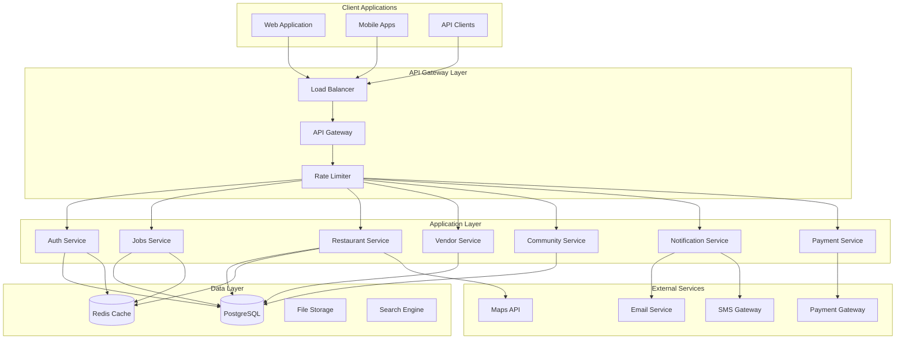
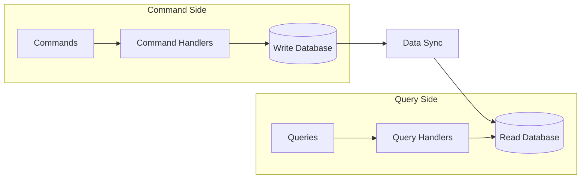
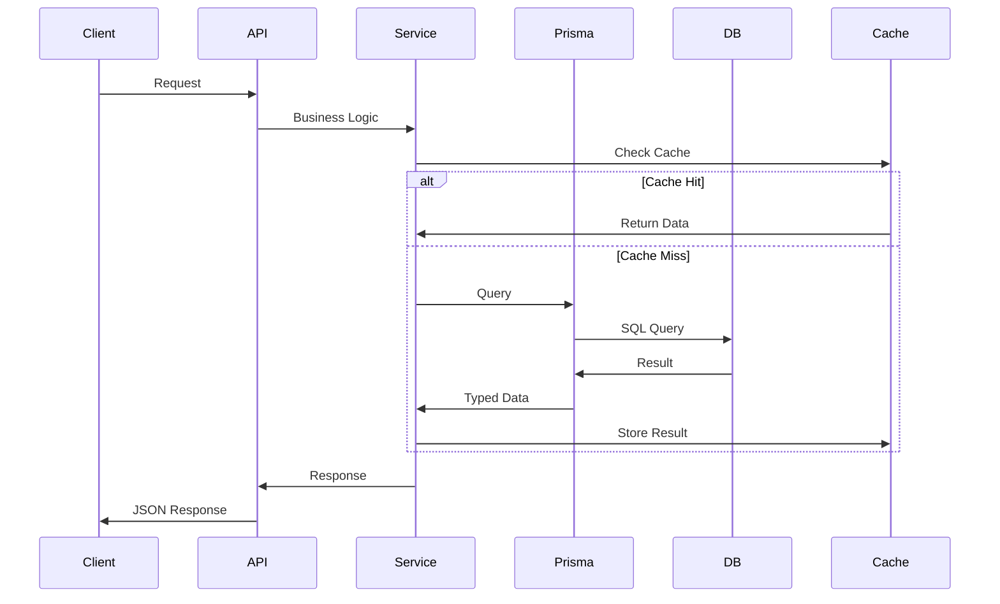
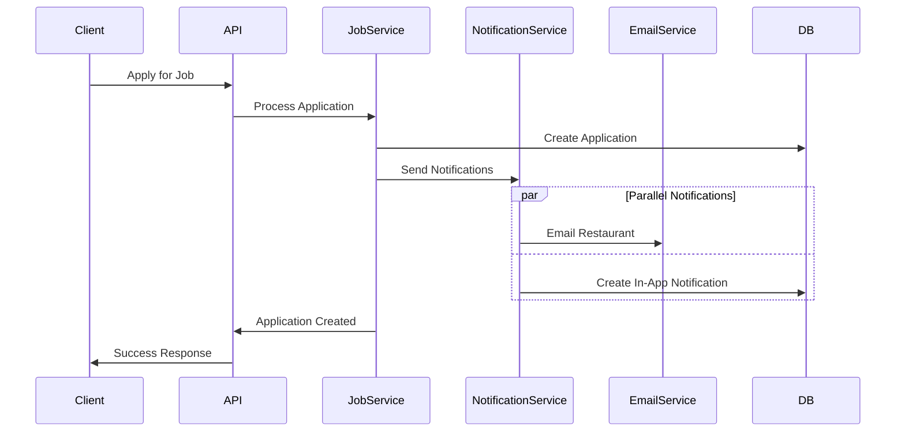

# RestaurantHub System Architecture

This document provides a comprehensive overview of the RestaurantHub platform architecture, including system design, technology stack, data flow, and deployment strategies.

## Table of Contents

1. [System Overview](#system-overview)
2. [Architecture Patterns](#architecture-patterns)
3. [Technology Stack](#technology-stack)
4. [System Components](#system-components)
5. [Data Architecture](#data-architecture)
6. [Security Architecture](#security-architecture)
7. [Scalability Design](#scalability-design)
8. [Integration Patterns](#integration-patterns)
9. [Deployment Architecture](#deployment-architecture)
10. [Monitoring & Observability](#monitoring--observability)

## System Overview

RestaurantHub is a comprehensive B2B/B2C SaaS platform designed for the restaurant industry. The platform follows a microservices-inspired architecture with a unified API gateway, supporting multiple user roles and complex business workflows.

### Core Objectives

- **Scalability**: Handle growth from small restaurants to large enterprise chains
- **Reliability**: Ensure 99.9% uptime with robust error handling
- **Security**: Protect sensitive business and customer data
- **Performance**: Sub-second response times for critical operations
- **Maintainability**: Modular design for easy updates and feature additions

### High-Level Architecture



## Architecture Patterns

### 1. Modular Monolith with Microservices Readiness

The current architecture implements a **modular monolith** that can be easily decomposed into microservices as the system scales.

**Benefits:**
- Simpler deployment and debugging
- Reduced network latency
- Easier data consistency management
- Lower operational complexity

**Migration Path:**
- Each module is designed as a bounded context
- Clear service boundaries defined
- Database per service pattern ready
- Independent scalability possible

### 2. Domain-Driven Design (DDD)

The system follows DDD principles with clear domain boundaries:

```
Domains:
├── Identity & Access Management
├── Restaurant Management
├── Job & HR Management
├── Marketplace & Vendor Management
├── Community & Social Features
├── Financial Management
├── Notification & Communication
└── Analytics & Reporting
```

### 3. CQRS (Command Query Responsibility Segregation)

For complex operations, the system separates read and write operations:



### 4. Event-Driven Architecture

Key business events trigger cascading actions across the system:

```typescript
// Example Event Flow
interface JobApplicationCreated {
  jobId: string;
  applicantId: string;
  restaurantId: string;
  timestamp: Date;
}

// Event Handlers
- NotificationService.sendApplicationNotification()
- AnalyticsService.trackApplicationMetrics()
- EmailService.sendConfirmationEmail()
```

## Technology Stack

### Backend Technologies

#### Core Framework
- **NestJS**: Node.js framework for building scalable server-side applications
- **TypeScript**: Type-safe JavaScript for better development experience
- **Express.js**: Underlying HTTP server framework

#### Database & ORM
- **PostgreSQL**: Primary relational database
- **Prisma**: Type-safe database client and ORM
- **Redis**: Caching and session storage
- **ElasticSearch**: Full-text search and analytics (planned)

#### Authentication & Security
- **JWT**: JSON Web Tokens for stateless authentication
- **bcrypt**: Password hashing
- **Helmet**: Security headers
- **CORS**: Cross-origin resource sharing
- **Rate Limiting**: Request throttling

#### External Integrations
- **Razorpay/Stripe**: Payment processing
- **Twilio/AWS SES**: SMS and email services
- **Cloudinary**: Image and file storage
- **Google Maps**: Location services

### Frontend Technologies (Client Applications)

#### Web Application
- **Next.js**: React framework with SSR/SSG
- **TypeScript**: Type safety
- **Tailwind CSS**: Utility-first CSS framework
- **React Query**: Server state management

#### Mobile Applications
- **React Native**: Cross-platform mobile development
- **Expo**: Development and deployment platform

### DevOps & Infrastructure

#### Development
- **Docker**: Containerization
- **Docker Compose**: Local development environment
- **Git**: Version control
- **GitHub Actions**: CI/CD pipeline

#### Monitoring & Logging
- **Winston**: Application logging
- **Prometheus**: Metrics collection
- **Grafana**: Metrics visualization
- **Sentry**: Error tracking

#### Deployment
- **AWS/GCP**: Cloud infrastructure
- **Kubernetes**: Container orchestration
- **NGINX**: Reverse proxy and load balancing
- **Let's Encrypt**: SSL certificates

## System Components

### 1. API Gateway

Central entry point for all client requests with cross-cutting concerns:

```typescript
@Module({
  imports: [
    AuthModule,
    JobsModule,
    RestaurantModule,
    VendorModule,
    CommunityModule,
    NotificationModule,
    PaymentModule,
  ],
})
export class AppModule {
  configure(consumer: MiddlewareConsumer) {
    consumer
      .apply(LoggingMiddleware)
      .forRoutes('*')
      .apply(RateLimitMiddleware)
      .forRoutes('*')
      .apply(SecurityMiddleware)
      .forRoutes('*');
  }
}
```

**Responsibilities:**
- Request routing and load balancing
- Authentication and authorization
- Rate limiting and throttling
- Request/response logging
- Error handling and transformation
- API versioning
- CORS and security headers

### 2. Authentication Service

Centralized identity and access management:

```typescript
@Injectable()
export class AuthService {
  async signUp(signUpDto: SignUpDto): Promise<AuthResponse> {
    // User creation with role-specific setup
    const user = await this.createUser(signUpDto);
    await this.setupRoleSpecificData(user, signUpDto);
    const tokens = await this.generateTokens(user);
    await this.sendVerificationEmail(user);
    return { user, tokens };
  }

  async signIn(signInDto: SignInDto): Promise<AuthResponse> {
    // Multi-factor authentication with security checks
    const user = await this.validateUser(signInDto);
    await this.checkAccountSecurity(user);
    const tokens = await this.generateTokens(user);
    await this.logSecurityEvent('LOGIN_SUCCESS', user);
    return { user, tokens };
  }
}
```

**Features:**
- Multi-role user management (Admin, Restaurant, Employee, Vendor)
- JWT-based stateless authentication
- Refresh token rotation
- Multi-factor authentication (planned)
- Session management and monitoring
- Account lockout and brute force protection
- Email verification and password reset

### 3. Job Management Service

Comprehensive job portal functionality:

```typescript
@Injectable()
export class JobsService {
  async create(restaurantId: string, userId: string, createJobDto: CreateJobDto) {
    // Job creation with validation and indexing
    const job = await this.prisma.job.create({
      data: {
        ...createJobDto,
        restaurantId,
        createdBy: userId,
        status: JobStatus.DRAFT,
      },
    });

    await this.searchService.indexJob(job);
    await this.notificationService.notifyNewJob(job);
    return job;
  }

  async applyForJob(jobId: string, employeeId: string, applicationData: any) {
    // Application with verification checks
    await this.verificationService.checkEmployeeVerification(employeeId);

    const application = await this.prisma.jobApplication.create({
      data: {
        jobId,
        employeeId,
        ...applicationData,
        status: ApplicationStatus.PENDING,
      },
    });

    await this.notificationService.notifyJobApplication(application);
    return application;
  }
}
```

**Features:**
- Job posting and management
- Advanced search and filtering
- Application tracking and management
- Employee verification requirements
- Automated notifications
- Performance analytics

### 4. Restaurant Management Service

Restaurant operations and profile management:

```typescript
@Injectable()
export class RestaurantService {
  async updateProfile(restaurantId: string, updateData: UpdateRestaurantDto) {
    // Profile update with verification tracking
    const restaurant = await this.prisma.restaurant.update({
      where: { id: restaurantId },
      data: updateData,
    });

    if (updateData.licenseNumber || updateData.gstNumber) {
      await this.verificationService.triggerReVerification(restaurant);
    }

    await this.cacheService.invalidateRestaurantCache(restaurantId);
    return restaurant;
  }

  async getAnalytics(restaurantId: string, period: string) {
    // Analytics with caching
    const cacheKey = `analytics:${restaurantId}:${period}`;
    let analytics = await this.cacheService.get(cacheKey);

    if (!analytics) {
      analytics = await this.analyticsService.generateRestaurantAnalytics(
        restaurantId,
        period
      );
      await this.cacheService.set(cacheKey, analytics, 3600); // 1 hour
    }

    return analytics;
  }
}
```

### 5. Vendor & Marketplace Service

B2B marketplace functionality:

```typescript
@Injectable()
export class VendorService {
  async createProduct(vendorId: string, productData: CreateProductDto) {
    const product = await this.prisma.product.create({
      data: {
        ...productData,
        vendorId,
        sku: await this.generateSKU(productData),
        status: ProductStatus.ACTIVE,
      },
    });

    await this.inventoryService.initializeStock(product);
    await this.searchService.indexProduct(product);
    return product;
  }

  async processOrder(orderId: string) {
    const order = await this.orderService.processVendorOrder(orderId);
    await this.inventoryService.updateStock(order.items);
    await this.notificationService.notifyOrderProcessed(order);
    return order;
  }
}
```

### 6. Community Service

Social features and knowledge sharing:

```typescript
@Injectable()
export class CommunityService {
  async createPost(userId: string, postData: CreatePostDto) {
    const post = await this.prisma.forumPost.create({
      data: {
        ...postData,
        userId,
        slug: await this.generateSlug(postData.title),
      },
    });

    await this.reputationService.awardPoints(userId, 'POST_CREATED');
    await this.notificationService.notifyNewPost(post);
    return post;
  }

  async likePost(postId: string, userId: string) {
    const like = await this.prisma.postLike.create({
      data: { postId, userId },
    });

    await this.prisma.forumPost.update({
      where: { id: postId },
      data: { likeCount: { increment: 1 } },
    });

    const post = await this.prisma.forumPost.findUnique({
      where: { id: postId },
      include: { author: true },
    });

    await this.reputationService.awardPoints(post.author.id, 'LIKE_RECEIVED');
    return like;
  }
}
```

## Data Architecture

### Database Design Principles

1. **Normalization**: Proper normalization to reduce redundancy
2. **Indexing**: Strategic indexing for query performance
3. **Constraints**: Foreign key and check constraints for data integrity
4. **Soft Deletes**: Preserve data with `deletedAt` timestamps
5. **Audit Trail**: Complete change tracking with audit logs

### Data Flow Patterns

#### 1. CRUD Operations


#### 2. Complex Business Operations


### Caching Strategy

#### Multi-Level Caching

1. **Application Cache**: In-memory caching for static data
2. **Redis Cache**: Distributed caching for session and query results
3. **Database Cache**: PostgreSQL query result caching
4. **CDN Cache**: Static asset and API response caching

```typescript
@Injectable()
export class CacheService {
  // L1: Memory Cache (fastest)
  private memoryCache = new Map();

  // L2: Redis Cache (distributed)
  constructor(private redis: Redis) {}

  async get(key: string): Promise<any> {
    // Check memory cache first
    if (this.memoryCache.has(key)) {
      return this.memoryCache.get(key);
    }

    // Check Redis cache
    const cached = await this.redis.get(key);
    if (cached) {
      const data = JSON.parse(cached);
      this.memoryCache.set(key, data); // Populate L1 cache
      return data;
    }

    return null;
  }

  async set(key: string, value: any, ttl: number): Promise<void> {
    // Store in both caches
    this.memoryCache.set(key, value);
    await this.redis.setex(key, ttl, JSON.stringify(value));
  }
}
```

## Security Architecture

### Authentication & Authorization

#### JWT Token Security
```typescript
@Injectable()
export class SecurityService {
  generateTokens(user: User): TokenPair {
    const payload = {
      sub: user.id,
      email: user.email,
      role: user.role,
      isVerified: user.isVerified,
    };

    const accessToken = this.jwtService.sign(payload, {
      expiresIn: '1h',
      issuer: 'restauranthub-api',
      audience: 'restauranthub-clients',
    });

    const refreshToken = this.jwtService.sign(
      { sub: user.id, type: 'refresh' },
      { expiresIn: '7d', secret: this.refreshSecret }
    );

    return { accessToken, refreshToken };
  }

  async validateToken(token: string): Promise<User | null> {
    try {
      // Check if token is blacklisted
      const isBlacklisted = await this.isTokenBlacklisted(token);
      if (isBlacklisted) return null;

      const payload = this.jwtService.verify(token);
      return await this.userService.findById(payload.sub);
    } catch (error) {
      return null;
    }
  }
}
```

#### Role-Based Access Control
```typescript
@Injectable()
export class AuthorizationService {
  async checkPermission(user: User, resource: string, action: string): Promise<boolean> {
    const permissions = await this.getPermissions(user.role);
    return permissions.some(p =>
      p.resource === resource &&
      p.actions.includes(action)
    );
  }

  private async getPermissions(role: UserRole): Promise<Permission[]> {
    const rolePermissions = {
      [UserRole.ADMIN]: [
        { resource: '*', actions: ['*'] },
      ],
      [UserRole.RESTAURANT]: [
        { resource: 'restaurant', actions: ['read', 'update'] },
        { resource: 'job', actions: ['create', 'read', 'update', 'delete'] },
        { resource: 'employee', actions: ['read', 'update'] },
      ],
      [UserRole.EMPLOYEE]: [
        { resource: 'job', actions: ['read', 'apply'] },
        { resource: 'profile', actions: ['read', 'update'] },
      ],
      [UserRole.VENDOR]: [
        { resource: 'product', actions: ['create', 'read', 'update', 'delete'] },
        { resource: 'order', actions: ['read', 'update'] },
      ],
    };

    return rolePermissions[role] || [];
  }
}
```

### Data Protection

#### Input Validation & Sanitization
```typescript
@Injectable()
export class ValidationService {
  sanitizeInput(data: any): any {
    return this.recursiveSanitize(data);
  }

  private recursiveSanitize(obj: any): any {
    if (typeof obj === 'string') {
      return this.sanitizeString(obj);
    }

    if (Array.isArray(obj)) {
      return obj.map(item => this.recursiveSanitize(item));
    }

    if (obj && typeof obj === 'object') {
      const sanitized = {};
      for (const [key, value] of Object.entries(obj)) {
        sanitized[key] = this.recursiveSanitize(value);
      }
      return sanitized;
    }

    return obj;
  }

  private sanitizeString(str: string): string {
    return str
      .replace(/<script\b[^<]*(?:(?!<\/script>)<[^<]*)*<\/script>/gi, '')
      .replace(/javascript:/gi, '')
      .replace(/on\w+\s*=/gi, '');
  }
}
```

#### GDPR Compliance
```typescript
@Injectable()
export class PrivacyService {
  async exportUserData(userId: string): Promise<UserDataExport> {
    const user = await this.userService.findById(userId);
    const profile = await this.profileService.findByUserId(userId);
    const posts = await this.communityService.getUserPosts(userId);
    const jobs = await this.jobService.getUserJobs(userId);

    return {
      user: this.anonymizePersonalData(user),
      profile: this.anonymizePersonalData(profile),
      posts: posts.map(p => this.anonymizePersonalData(p)),
      jobs: jobs.map(j => this.anonymizePersonalData(j)),
      exportedAt: new Date(),
    };
  }

  async deleteUserData(userId: string, scope: string): Promise<void> {
    const user = await this.userService.findById(userId);

    switch (scope) {
      case 'profile_only':
        await this.profileService.anonymizeProfile(userId);
        break;
      case 'all_data':
        await this.softDeleteAllUserData(userId);
        break;
      case 'account_closure':
        await this.hardDeleteUserAccount(userId);
        break;
    }

    await this.auditService.logDataDeletion(user, scope);
  }
}
```

## Scalability Design

### Horizontal Scaling Strategies

#### 1. Database Scaling
```typescript
// Read Replica Configuration
@Injectable()
export class DatabaseService {
  constructor(
    @Inject('WRITE_DB') private writeDb: PrismaClient,
    @Inject('READ_DB') private readDb: PrismaClient,
  ) {}

  async findMany<T>(model: string, query: any): Promise<T[]> {
    // Use read replica for queries
    return this.readDb[model].findMany(query);
  }

  async create<T>(model: string, data: any): Promise<T> {
    // Use primary database for writes
    return this.writeDb[model].create({ data });
  }

  async update<T>(model: string, where: any, data: any): Promise<T> {
    // Use primary database for writes
    return this.writeDb[model].update({ where, data });
  }
}
```

#### 2. Service Decomposition
```typescript
// Microservice Ready Architecture
interface ServiceInterface {
  name: string;
  version: string;
  endpoints: Endpoint[];
  dependencies: ServiceDependency[];
}

const services: ServiceInterface[] = [
  {
    name: 'auth-service',
    version: '1.0.0',
    endpoints: ['/auth/login', '/auth/register', '/auth/refresh'],
    dependencies: ['user-db', 'redis-cache'],
  },
  {
    name: 'job-service',
    version: '1.0.0',
    endpoints: ['/jobs', '/jobs/:id', '/jobs/:id/apply'],
    dependencies: ['jobs-db', 'notification-service'],
  },
  // ... other services
];
```

#### 3. Caching & Performance
```typescript
@Injectable()
export class PerformanceService {
  @Cacheable(600) // 10 minutes
  async getPopularJobs(location: string): Promise<Job[]> {
    return this.jobService.findPopular({ location });
  }

  @Cacheable(3600) // 1 hour
  async getRestaurantAnalytics(restaurantId: string): Promise<Analytics> {
    return this.analyticsService.generate(restaurantId);
  }

  // Background job processing
  @Cron('0 0 * * *') // Daily
  async generateDailyReports(): Promise<void> {
    const restaurants = await this.restaurantService.findAll();

    for (const restaurant of restaurants) {
      await this.queue.add('generate-report', {
        restaurantId: restaurant.id,
        date: new Date(),
      });
    }
  }
}
```

### Load Balancing & High Availability

#### Load Balancer Configuration
```nginx
upstream api_servers {
    least_conn;
    server api1.restauranthub.com:3000 weight=3;
    server api2.restauranthub.com:3000 weight=3;
    server api3.restauranthub.com:3000 weight=2;
}

server {
    listen 443 ssl http2;
    server_name api.restauranthub.com;

    ssl_certificate /etc/ssl/restauranthub.crt;
    ssl_certificate_key /etc/ssl/restauranthub.key;

    location / {
        proxy_pass http://api_servers;
        proxy_set_header Host $host;
        proxy_set_header X-Real-IP $remote_addr;
        proxy_set_header X-Forwarded-For $proxy_add_x_forwarded_for;
        proxy_set_header X-Forwarded-Proto $scheme;

        # Health check
        proxy_next_upstream error timeout invalid_header http_500 http_502 http_503;
        proxy_connect_timeout 5s;
        proxy_send_timeout 60s;
        proxy_read_timeout 60s;
    }
}
```

## Integration Patterns

### External Service Integration

#### Payment Gateway Integration
```typescript
@Injectable()
export class PaymentService {
  constructor(
    private razorpay: RazorpayService,
    private stripe: StripeService,
  ) {}

  async processPayment(order: Order, method: PaymentMethod): Promise<Payment> {
    const strategy = this.getPaymentStrategy(method);

    try {
      const result = await strategy.process(order);

      await this.paymentRepository.create({
        orderId: order.id,
        amount: order.totalAmount,
        method,
        status: PaymentStatus.COMPLETED,
        externalId: result.transactionId,
      });

      await this.orderService.updateStatus(order.id, OrderStatus.PAID);
      await this.notificationService.notifyPaymentSuccess(order);

      return result;
    } catch (error) {
      await this.handlePaymentError(order, error);
      throw error;
    }
  }

  private getPaymentStrategy(method: PaymentMethod): PaymentStrategy {
    const strategies = {
      [PaymentMethod.RAZORPAY]: this.razorpay,
      [PaymentMethod.STRIPE]: this.stripe,
    };

    return strategies[method];
  }
}
```

#### Email & SMS Integration
```typescript
@Injectable()
export class NotificationService {
  async sendNotification(notification: Notification): Promise<void> {
    const templates = await this.getTemplates(notification.type);

    // Multi-channel notification
    await Promise.allSettled([
      this.sendEmail(notification, templates.email),
      this.sendSMS(notification, templates.sms),
      this.sendPushNotification(notification, templates.push),
      this.createInAppNotification(notification),
    ]);
  }

  private async sendEmail(notification: Notification, template: EmailTemplate): Promise<void> {
    const content = this.templateEngine.render(template, notification.data);

    await this.emailService.send({
      to: notification.recipient.email,
      subject: content.subject,
      html: content.html,
      text: content.text,
    });
  }
}
```

### Webhook System

#### Outgoing Webhooks
```typescript
@Injectable()
export class WebhookService {
  async sendWebhook(event: WebhookEvent): Promise<void> {
    const subscribers = await this.getSubscribers(event.type);

    for (const subscriber of subscribers) {
      await this.deliverWebhook(subscriber, event);
    }
  }

  private async deliverWebhook(subscriber: WebhookSubscriber, event: WebhookEvent): Promise<void> {
    const payload = {
      id: generateId(),
      type: event.type,
      data: event.data,
      timestamp: new Date().toISOString(),
    };

    const signature = this.generateSignature(payload, subscriber.secret);

    try {
      await this.httpService.post(subscriber.url, payload, {
        headers: {
          'X-Webhook-Signature': signature,
          'X-Webhook-Event': event.type,
          'Content-Type': 'application/json',
        },
        timeout: 30000,
      });

      await this.logWebhookDelivery(subscriber, event, 'success');
    } catch (error) {
      await this.logWebhookDelivery(subscriber, event, 'failed', error);
      await this.scheduleRetry(subscriber, event);
    }
  }
}
```

## Deployment Architecture

### Container Strategy

#### Dockerfile
```dockerfile
# Multi-stage build
FROM node:18-alpine AS builder

WORKDIR /app
COPY package*.json ./
RUN npm ci --only=production

COPY . .
RUN npm run build

# Production image
FROM node:18-alpine AS production

RUN addgroup -g 1001 -S nodejs
RUN adduser -S nestjs -u 1001

WORKDIR /app

COPY --from=builder --chown=nestjs:nodejs /app/dist ./dist
COPY --from=builder --chown=nestjs:nodejs /app/node_modules ./node_modules
COPY --from=builder --chown=nestjs:nodejs /app/package.json ./package.json

USER nestjs

EXPOSE 3000

CMD ["node", "dist/main"]
```

#### Docker Compose
```yaml
version: '3.8'

services:
  api:
    build: .
    ports:
      - "3000:3000"
    environment:
      - NODE_ENV=production
      - DATABASE_URL=${DATABASE_URL}
      - REDIS_URL=${REDIS_URL}
    depends_on:
      - postgres
      - redis
    restart: unless-stopped

  postgres:
    image: postgres:14
    environment:
      - POSTGRES_DB=restauranthub
      - POSTGRES_USER=${DB_USER}
      - POSTGRES_PASSWORD=${DB_PASSWORD}
    volumes:
      - postgres_data:/var/lib/postgresql/data
    restart: unless-stopped

  redis:
    image: redis:7-alpine
    restart: unless-stopped

  nginx:
    image: nginx:alpine
    ports:
      - "80:80"
      - "443:443"
    volumes:
      - ./nginx.conf:/etc/nginx/nginx.conf
      - ./ssl:/etc/ssl
    depends_on:
      - api
    restart: unless-stopped

volumes:
  postgres_data:
```

### Kubernetes Deployment

#### API Deployment
```yaml
apiVersion: apps/v1
kind: Deployment
metadata:
  name: restauranthub-api
spec:
  replicas: 3
  selector:
    matchLabels:
      app: restauranthub-api
  template:
    metadata:
      labels:
        app: restauranthub-api
    spec:
      containers:
      - name: api
        image: restauranthub/api:latest
        ports:
        - containerPort: 3000
        env:
        - name: DATABASE_URL
          valueFrom:
            secretKeyRef:
              name: database-secret
              key: url
        - name: REDIS_URL
          valueFrom:
            secretKeyRef:
              name: redis-secret
              key: url
        livenessProbe:
          httpGet:
            path: /health
            port: 3000
          initialDelaySeconds: 30
          periodSeconds: 10
        readinessProbe:
          httpGet:
            path: /health
            port: 3000
          initialDelaySeconds: 5
          periodSeconds: 5
---
apiVersion: v1
kind: Service
metadata:
  name: restauranthub-api-service
spec:
  selector:
    app: restauranthub-api
  ports:
  - port: 80
    targetPort: 3000
  type: ClusterIP
```

### CI/CD Pipeline

#### GitHub Actions
```yaml
name: CI/CD Pipeline

on:
  push:
    branches: [main, develop]
  pull_request:
    branches: [main]

jobs:
  test:
    runs-on: ubuntu-latest
    steps:
      - uses: actions/checkout@v3
      - uses: actions/setup-node@v3
        with:
          node-version: '18'
          cache: 'npm'

      - run: npm ci
      - run: npm run test
      - run: npm run test:e2e

      - name: Code Coverage
        uses: codecov/codecov-action@v3

  build:
    needs: test
    runs-on: ubuntu-latest
    if: github.ref == 'refs/heads/main'

    steps:
      - uses: actions/checkout@v3

      - name: Build Docker Image
        run: |
          docker build -t restauranthub/api:${{ github.sha }} .
          docker tag restauranthub/api:${{ github.sha }} restauranthub/api:latest

      - name: Push to Registry
        run: |
          echo ${{ secrets.DOCKER_PASSWORD }} | docker login -u ${{ secrets.DOCKER_USERNAME }} --password-stdin
          docker push restauranthub/api:${{ github.sha }}
          docker push restauranthub/api:latest

  deploy:
    needs: build
    runs-on: ubuntu-latest
    if: github.ref == 'refs/heads/main'

    steps:
      - name: Deploy to Production
        run: |
          kubectl set image deployment/restauranthub-api api=restauranthub/api:${{ github.sha }}
          kubectl rollout status deployment/restauranthub-api
```

## Monitoring & Observability

### Application Monitoring

#### Health Checks
```typescript
@Controller('health')
export class HealthController {
  constructor(
    private prisma: PrismaService,
    private redis: RedisService,
  ) {}

  @Get()
  async check(): Promise<HealthCheck> {
    const checks = await Promise.allSettled([
      this.checkDatabase(),
      this.checkRedis(),
      this.checkExternalServices(),
    ]);

    const status = checks.every(check => check.status === 'fulfilled')
      ? 'healthy'
      : 'unhealthy';

    return {
      status,
      timestamp: new Date().toISOString(),
      version: process.env.APP_VERSION,
      checks: {
        database: this.getCheckResult(checks[0]),
        redis: this.getCheckResult(checks[1]),
        external: this.getCheckResult(checks[2]),
      },
    };
  }

  private async checkDatabase(): Promise<boolean> {
    try {
      await this.prisma.$queryRaw`SELECT 1`;
      return true;
    } catch (error) {
      return false;
    }
  }
}
```

#### Metrics Collection
```typescript
@Injectable()
export class MetricsService {
  private requestCounter = new Counter({
    name: 'http_requests_total',
    help: 'Total HTTP requests',
    labelNames: ['method', 'route', 'status'],
  });

  private requestDuration = new Histogram({
    name: 'http_request_duration_seconds',
    help: 'HTTP request duration',
    labelNames: ['method', 'route'],
  });

  recordRequest(method: string, route: string, status: number, duration: number): void {
    this.requestCounter.inc({ method, route, status: status.toString() });
    this.requestDuration.observe({ method, route }, duration / 1000);
  }

  @Cron('*/30 * * * * *') // Every 30 seconds
  async collectBusinessMetrics(): Promise<void> {
    const metrics = await this.calculateBusinessMetrics();

    this.businessMetricsGauge.set({ metric: 'active_users' }, metrics.activeUsers);
    this.businessMetricsGauge.set({ metric: 'total_orders' }, metrics.totalOrders);
    this.businessMetricsGauge.set({ metric: 'revenue' }, metrics.revenue);
  }
}
```

### Logging Strategy

#### Structured Logging
```typescript
@Injectable()
export class LoggerService {
  private logger = winston.createLogger({
    format: winston.format.combine(
      winston.format.timestamp(),
      winston.format.errors({ stack: true }),
      winston.format.json(),
    ),
    transports: [
      new winston.transports.Console(),
      new winston.transports.File({
        filename: 'logs/error.log',
        level: 'error',
      }),
      new winston.transports.File({
        filename: 'logs/combined.log',
      }),
    ],
  });

  logRequest(req: Request, res: Response, duration: number): void {
    this.logger.info('HTTP Request', {
      method: req.method,
      url: req.url,
      status: res.statusCode,
      duration,
      userAgent: req.get('User-Agent'),
      ip: req.ip,
      userId: req.user?.id,
    });
  }

  logError(error: Error, context?: any): void {
    this.logger.error('Application Error', {
      message: error.message,
      stack: error.stack,
      context,
      timestamp: new Date().toISOString(),
    });
  }
}
```

This comprehensive architecture documentation provides a complete overview of the RestaurantHub system design, including detailed implementation patterns, security considerations, scalability strategies, and operational practices. The architecture is designed to be robust, scalable, and maintainable while supporting the complex business requirements of the restaurant industry platform.