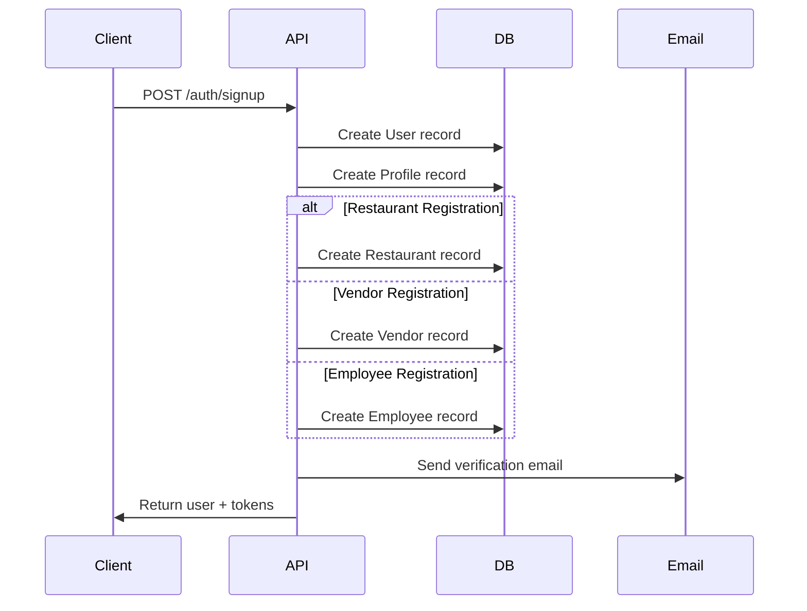
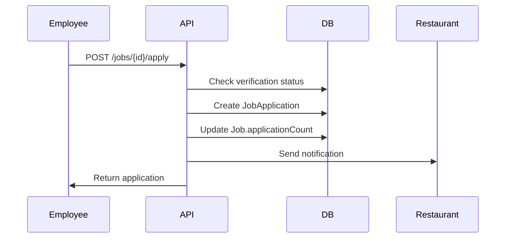
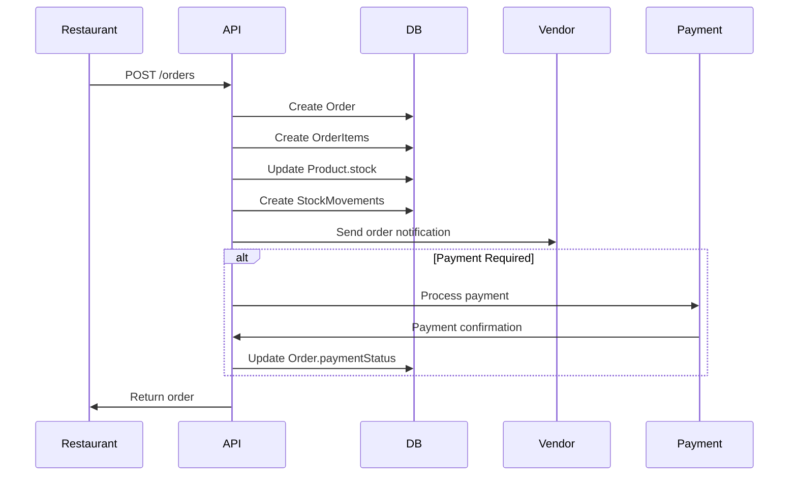
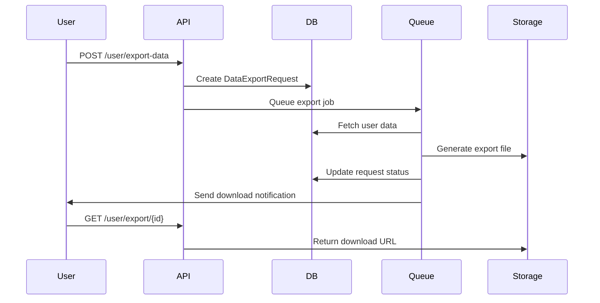

# Database Schema Documentation

This document provides comprehensive documentation of the RestoPapa database schema, including entity relationships, constraints, and usage patterns.

## Table of Contents

1. [Overview](#overview)
2. [Core Entities](#core-entities)
3. [Authentication & Users](#authentication--users)
4. [Business Entities](#business-entities)
5. [Job Management](#job-management)
6. [Marketplace & Orders](#marketplace--orders)
7. [Community Features](#community-features)
8. [Financial Management](#financial-management)
9. [Operational Systems](#operational-systems)
10. [Privacy & Compliance](#privacy--compliance)
11. [Relationships](#relationships)
12. [Indexes & Performance](#indexes--performance)
13. [Data Flows](#data-flows)

## Overview

The RestoPapa database is designed using PostgreSQL with Prisma ORM. The schema follows a multi-tenant architecture supporting different user roles and business operations in the restaurant industry.

### Key Features
- **Multi-role system**: Admin, Restaurant, Employee, Vendor roles
- **Comprehensive business management**: End-to-end restaurant operations
- **Scalable architecture**: Designed for high throughput and growth
- **GDPR compliance**: Built-in privacy and data protection features
- **Audit trail**: Complete tracking of all system changes

### Database Technology Stack
- **Database**: PostgreSQL 14+
- **ORM**: Prisma 5.x
- **Migration**: Prisma Migrate
- **Backup**: Automated daily backups
- **Monitoring**: Query performance monitoring

## Core Entities

### User Management

#### User
The central user entity supporting multiple roles and authentication.

```sql
Table: User
- id (String, Primary Key, CUID)
- email (String, Unique)
- phone (String, Unique, Nullable)
- passwordHash (String)
- role (UserRole: ADMIN | RESTAURANT | EMPLOYEE | VENDOR)
- isActive (Boolean, Default: true)
- isVerified (Boolean, Default: false)
- emailVerifiedAt (DateTime, Nullable)
- isAadhaarVerified (Boolean, Default: false)
- twoFactorEnabled (Boolean, Default: false)
- lastLoginAt (DateTime, Nullable)
- createdAt (DateTime, Default: now())
- updatedAt (DateTime, Auto-update)
- deletedAt (DateTime, Nullable) -- Soft delete
```

**Key Features:**
- Soft delete support via `deletedAt`
- Two-factor authentication support
- Aadhaar verification for Indian compliance
- Multiple authentication methods (email, phone)

#### Profile
Extended user information and preferences.

```sql
Table: Profile
- id (String, Primary Key, CUID)
- userId (String, Foreign Key -> User.id, Unique)
- firstName (String)
- lastName (String)
- avatar (String, Nullable) -- Profile image URL
- bio (String, Nullable)
- address (String, Nullable)
- city (String, Nullable)
- state (String, Nullable)
- country (String, Nullable)
- pincode (String, Nullable)
- dateOfBirth (DateTime, Nullable)
- createdAt (DateTime, Default: now())
- updatedAt (DateTime, Auto-update)
```

#### Session
User authentication sessions for security tracking.

```sql
Table: Session
- id (String, Primary Key, CUID)
- userId (String, Foreign Key -> User.id)
- token (String, Unique) -- JWT token hash
- ipAddress (String, Nullable)
- userAgent (String, Nullable)
- expiresAt (DateTime)
- createdAt (DateTime, Default: now())
```

## Business Entities

### Restaurant
Core restaurant entity with verification and business information.

```sql
Table: Restaurant
- id (String, Primary Key, CUID)
- userId (String, Foreign Key -> User.id, Unique)
- name (String)
- description (String, Nullable)
- logo (String, Nullable) -- Logo image URL
- banner (String, Nullable) -- Banner image URL
- cuisineType (String[]) -- Array of cuisine types
- licenseNumber (String, Unique, Nullable)
- gstNumber (String, Unique, Nullable)
- fssaiNumber (String, Unique, Nullable)
- panNumber (String, Nullable)
- bankAccountNumber (String, Nullable)
- bankName (String, Nullable)
- ifscCode (String, Nullable)
- verificationStatus (VerificationStatus: PENDING | VERIFIED | REJECTED)
- verifiedAt (DateTime, Nullable)
- rating (Float, Default: 0)
- totalReviews (Int, Default: 0)
- isActive (Boolean, Default: true)
- createdAt (DateTime, Default: now())
- updatedAt (DateTime, Auto-update)
- deletedAt (DateTime, Nullable)
```

**Business Rules:**
- Each restaurant must have a unique license number
- GST number required for tax compliance
- FSSAI number required for food safety compliance
- Rating calculated from customer reviews

### Branch
Multi-location support for restaurant chains.

```sql
Table: Branch
- id (String, Primary Key, CUID)
- restaurantId (String, Foreign Key -> Restaurant.id)
- name (String)
- address (String)
- city (String)
- state (String)
- pincode (String)
- phone (String)
- email (String, Nullable)
- managerId (String, Nullable)
- latitude (Float, Nullable) -- GPS coordinates
- longitude (Float, Nullable)
- isActive (Boolean, Default: true)
- createdAt (DateTime, Default: now())
- updatedAt (DateTime, Auto-update)
```

### Vendor
Supplier and vendor management for B2B marketplace.

```sql
Table: Vendor
- id (String, Primary Key, CUID)
- userId (String, Foreign Key -> User.id, Unique)
- companyName (String)
- description (String, Nullable)
- logo (String, Nullable)
- businessType (String) -- E.g., "Food Wholesale", "Equipment Supplier"
- gstNumber (String, Unique, Nullable)
- panNumber (String, Nullable)
- bankAccountNumber (String, Nullable)
- bankName (String, Nullable)
- ifscCode (String, Nullable)
- verificationStatus (VerificationStatus)
- verifiedAt (DateTime, Nullable)
- rating (Float, Default: 0)
- totalReviews (Int, Default: 0)
- isActive (Boolean, Default: true)
- createdAt (DateTime, Default: now())
- updatedAt (DateTime, Auto-update)
- deletedAt (DateTime, Nullable)
```

### Employee
Employee records with restaurant association and HR information.

```sql
Table: Employee
- id (String, Primary Key, CUID)
- userId (String, Foreign Key -> User.id, Unique)
- restaurantId (String, Foreign Key -> Restaurant.id)
- branchId (String, Foreign Key -> Branch.id, Nullable)
- employeeCode (String, Unique) -- Internal employee ID
- designation (String)
- department (String, Nullable)
- aadharNumber (String, Nullable) -- Aadhaar for verification
- aadharVerified (Boolean, Default: false)
- verifiedAt (DateTime, Nullable)
- salary (Float, Nullable)
- joiningDate (DateTime)
- relievingDate (DateTime, Nullable)
- isActive (Boolean, Default: true)
- createdAt (DateTime, Default: now())
- updatedAt (DateTime, Auto-update)
```

## Job Management

### Job
Job postings with detailed requirements and metadata.

```sql
Table: Job
- id (String, Primary Key, CUID)
- restaurantId (String, Foreign Key -> Restaurant.id)
- title (String)
- description (String)
- requirements (String[]) -- Array of job requirements
- skills (String[]) -- Array of required skills
- experienceMin (Int, Default: 0)
- experienceMax (Int, Nullable)
- salaryMin (Float, Nullable)
- salaryMax (Float, Nullable)
- location (String)
- jobType (String) -- "Full-time", "Part-time", "Contract"
- status (JobStatus: DRAFT | OPEN | CLOSED | FILLED)
- validTill (DateTime) -- Job posting expiry
- viewCount (Int, Default: 0)
- applicationCount (Int, Default: 0)
- createdAt (DateTime, Default: now())
- updatedAt (DateTime, Auto-update)
```

### JobApplication
Applications submitted by employees for job postings.

```sql
Table: JobApplication
- id (String, Primary Key, CUID)
- jobId (String, Foreign Key -> Job.id)
- employeeId (String, Foreign Key -> Employee.id)
- coverLetter (String, Nullable)
- resume (String, Nullable) -- Resume file URL
- status (ApplicationStatus: PENDING | REVIEWED | SHORTLISTED | ACCEPTED | REJECTED)
- reviewedAt (DateTime, Nullable)
- reviewNotes (String, Nullable)
- createdAt (DateTime, Default: now())
- updatedAt (DateTime, Auto-update)

UNIQUE CONSTRAINT: (jobId, employeeId) -- One application per employee per job
```

### Employee Performance & Tags

#### EmployeeTag
Performance tracking and feedback system for employees.

```sql
Table: EmployeeTag
- id (String, Primary Key, CUID)
- employeeId (String, Foreign Key -> Employee.id)
- restaurantId (String, Foreign Key -> Restaurant.id)
- taggedBy (String, Foreign Key -> User.id)
- type (EmployeeTagType: POSITIVE | NEGATIVE | NEUTRAL)
- category (String) -- "Performance", "Attitude", "Punctuality"
- reason (String)
- details (String, Nullable)
- evidence (String[]) -- Array of supporting document URLs
- status (TagStatus: ACTIVE | DISPUTED | RESOLVED)
- isPublic (Boolean, Default: true)
- severity (Int, Default: 1) -- Scale 1-5
- createdAt (DateTime, Default: now())
- updatedAt (DateTime, Auto-update)
```

#### EmployeeDefense
Defense mechanism for employees to respond to negative tags.

```sql
Table: EmployeeDefense
- id (String, Primary Key, CUID)
- tagId (String, Foreign Key -> EmployeeTag.id)
- employeeId (String, Foreign Key -> Employee.id)
- response (String)
- evidence (String[]) -- Supporting documents
- isResolved (Boolean, Default: false)
- resolvedBy (String, Foreign Key -> User.id, Nullable)
- resolutionNote (String, Nullable)
- createdAt (DateTime, Default: now())
- updatedAt (DateTime, Auto-update)
```

## Marketplace & Orders

### Category
Product categorization for the marketplace.

```sql
Table: Category
- id (String, Primary Key, CUID)
- name (String, Unique)
- slug (String, Unique) -- URL-friendly name
- description (String, Nullable)
- image (String, Nullable)
- parentId (String, Foreign Key -> Category.id, Nullable)
- displayOrder (Int, Default: 0)
- isActive (Boolean, Default: true)
- createdAt (DateTime, Default: now())
- updatedAt (DateTime, Auto-update)
```

### Product
Products offered by vendors in the marketplace.

```sql
Table: Product
- id (String, Primary Key, CUID)
- vendorId (String, Foreign Key -> Vendor.id, Nullable)
- restaurantId (String, Foreign Key -> Restaurant.id, Nullable)
- categoryId (String, Foreign Key -> Category.id)
- name (String)
- slug (String)
- description (String, Nullable)
- images (String[]) -- Product image URLs
- sku (String, Unique) -- Stock Keeping Unit
- price (Float)
- comparePrice (Float, Nullable) -- Original price for discounts
- costPrice (Float, Nullable) -- Cost for profit calculation
- quantity (Int, Default: 0)
- unit (String) -- "kg", "pieces", "liters"
- minOrderQuantity (Int, Default: 1)
- maxOrderQuantity (Int, Nullable)
- gstRate (Float, Default: 18) -- GST percentage
- hsnCode (String, Nullable) -- HSN code for tax
- status (ProductStatus: ACTIVE | INACTIVE | OUT_OF_STOCK)
- isWholesale (Boolean, Default: false)
- isBulkOnly (Boolean, Default: false)
- viewCount (Int, Default: 0)
- rating (Float, Default: 0)
- totalReviews (Int, Default: 0)
- tags (String[]) -- Search tags

-- Inventory Management
- stock (Int, Default: 0)
- reservedStock (Int, Default: 0)
- minStock (Int, Default: 10)
- maxStock (Int, Nullable)
- reorderPoint (Int, Nullable)
- autoReorder (Boolean, Default: false)

- createdAt (DateTime, Default: now())
- updatedAt (DateTime, Auto-update)
- deletedAt (DateTime, Nullable)
```

### Order
Order management for B2B transactions.

```sql
Table: Order
- id (String, Primary Key, CUID)
- orderNumber (String, Unique) -- Human-readable order number
- restaurantId (String, Foreign Key -> Restaurant.id)
- vendorId (String, Foreign Key -> Vendor.id, Nullable)
- subtotal (Float)
- gstAmount (Float)
- shippingAmount (Float, Default: 0)
- discountAmount (Float, Default: 0)
- totalAmount (Float)
- status (OrderStatus: PENDING | CONFIRMED | PREPARING | PROCESSING | SHIPPED | DELIVERED | CANCELLED | REFUNDED)
- paymentMethod (String, Nullable)
- paymentStatus (PaymentStatus: PENDING | PROCESSING | COMPLETED | FAILED | REFUNDED)
- shippingAddress (Json, Nullable) -- Address object
- billingAddress (Json, Nullable)
- notes (String, Nullable)
- invoiceNumber (String, Nullable)
- invoiceUrl (String, Nullable)
- trackingNumber (String, Nullable)
- deliveredAt (DateTime, Nullable)
- cancelledAt (DateTime, Nullable)
- cancelReason (String, Nullable)
- creditUsed (Float, Default: 0)
- createdAt (DateTime, Default: now())
- updatedAt (DateTime, Auto-update)
```

### OrderItem
Individual items within an order.

```sql
Table: OrderItem
- id (String, Primary Key, CUID)
- orderId (String, Foreign Key -> Order.id)
- productId (String, Foreign Key -> Product.id)
- quantity (Int)
- price (Float) -- Price at time of order
- gstAmount (Float)
- totalAmount (Float)
- createdAt (DateTime, Default: now())
```

## Community Features

### Forum
Discussion forums for community engagement.

```sql
Table: Forum
- id (String, Primary Key, CUID)
- name (String, Unique)
- slug (String, Unique)
- description (String, Nullable)
- category (String)
- icon (String, Nullable)
- color (String, Nullable)
- isActive (Boolean, Default: true)
- memberCount (Int, Default: 0)
- postCount (Int, Default: 0)
- displayOrder (Int, Default: 0)
- createdAt (DateTime, Default: now())
- updatedAt (DateTime, Auto-update)
```

### ForumPost
Individual posts within forums.

```sql
Table: ForumPost
- id (String, Primary Key, CUID)
- forumId (String, Foreign Key -> Forum.id)
- userId (String, Foreign Key -> User.id)
- title (String)
- content (String)
- type (PostType: DISCUSSION | TIP | RECIPE | JOB_REQUEST | NEWS | REVIEW | VENDOR_REQUEST | PRODUCT_REQUEST | ANNOUNCEMENT)
- visibility (PostVisibility: PUBLIC | FOLLOWERS | PRIVATE)
- slug (String, Unique)
- images (String[])
- attachments (String[])
- tags (String[])
- viewCount (Int, Default: 0)
- likeCount (Int, Default: 0)
- shareCount (Int, Default: 0)
- commentCount (Int, Default: 0)
- isPinned (Boolean, Default: false)
- isLocked (Boolean, Default: false)
- isFeatured (Boolean, Default: false)
- isDeleted (Boolean, Default: false)
- deletedAt (DateTime, Nullable)
- createdAt (DateTime, Default: now())
- updatedAt (DateTime, Auto-update)
```

### User Interaction Tables

#### PostLike
User likes on forum posts.

```sql
Table: PostLike
- id (String, Primary Key, CUID)
- postId (String, Foreign Key -> ForumPost.id)
- userId (String, Foreign Key -> User.id)
- createdAt (DateTime, Default: now())

UNIQUE CONSTRAINT: (postId, userId)
```

#### PostComment
Comments on forum posts.

```sql
Table: PostComment
- id (String, Primary Key, CUID)
- postId (String, Foreign Key -> ForumPost.id)
- userId (String, Foreign Key -> User.id)
- parentId (String, Foreign Key -> PostComment.id, Nullable)
- content (String)
- likeCount (Int, Default: 0)
- isDeleted (Boolean, Default: false)
- deletedAt (DateTime, Nullable)
- createdAt (DateTime, Default: now())
- updatedAt (DateTime, Auto-update)
```

### Reputation System

#### UserReputation
User reputation scores and metrics.

```sql
Table: UserReputation
- id (String, Primary Key, CUID)
- userId (String, Foreign Key -> User.id, Unique)
- totalPoints (Int, Default: 0)
- level (Int, Default: 1)
- postsCreated (Int, Default: 0)
- commentsCreated (Int, Default: 0)
- likesReceived (Int, Default: 0)
- sharesReceived (Int, Default: 0)
- helpfulSuggestions (Int, Default: 0)
- bestSuggestions (Int, Default: 0)
- badgeCount (Int, Default: 0)
- updatedAt (DateTime, Auto-update)
```

#### UserBadge
Achievement badges for user engagement.

```sql
Table: UserBadge
- id (String, Primary Key, CUID)
- userId (String, Foreign Key -> User.id)
- badgeType (BadgeType: TOP_HELPER | VENDOR_CONNECTOR | COMMUNITY_BUILDER | RECIPE_MASTER | JOB_EXPERT | TRENDING_CONTRIBUTOR | VERIFIED_REVIEWER)
- title (String)
- description (String)
- icon (String, Nullable)
- earnedAt (DateTime, Default: now())
- isVisible (Boolean, Default: true)

UNIQUE CONSTRAINT: (userId, badgeType)
```

## Financial Management

### Invoice
Comprehensive invoicing system with tax compliance.

```sql
Table: Invoice
- id (String, Primary Key, CUID)
- restaurantId (String, Foreign Key -> Restaurant.id)
- customerId (String, Foreign Key -> Customer.id, Nullable)
- orderId (String, Foreign Key -> Order.id, Nullable, Unique)

-- Invoice Details
- invoiceNumber (String, Unique)
- invoiceDate (DateTime, Default: now())
- dueDate (DateTime)
- status (InvoiceStatus: DRAFT | SENT | VIEWED | PAID | OVERDUE | CANCELLED | REFUNDED)

-- Amounts
- subtotal (Float)
- taxAmount (Float)
- discountAmount (Float, Default: 0)
- totalAmount (Float)
- paidAmount (Float, Default: 0)

-- Tax Compliance
- gstNumber (String, Nullable)
- placeOfSupply (String, Nullable)
- taxableValue (Float)

-- Content
- items (Json) -- Invoice items with tax breakdown
- terms (String, Nullable)
- notes (String, Nullable)

-- Payment Tracking
- paymentDueDate (DateTime, Nullable)
- lastPaymentDate (DateTime, Nullable)

- createdAt (DateTime, Default: now())
- updatedAt (DateTime, Auto-update)
```

### Payment
Payment processing and tracking.

```sql
Table: Payment
- id (String, Primary Key, CUID)
- restaurantId (String, Foreign Key -> Restaurant.id)
- invoiceId (String, Foreign Key -> Invoice.id, Nullable)
- orderId (String, Foreign Key -> Order.id, Nullable)
- customerId (String, Foreign Key -> Customer.id, Nullable)

-- Payment Details
- paymentNumber (String, Unique)
- amount (Float)
- currency (String, Default: "INR")
- method (PaymentMethod: CASH | CARD | UPI | NET_BANKING | WALLET | RAZORPAY | STRIPE | BANK_TRANSFER | CREDIT)
- status (PaymentStatus)

-- External References
- razorpayPaymentId (String, Nullable)
- stripePaymentId (String, Nullable)
- bankTransactionId (String, Nullable)
- upiTransactionId (String, Nullable)

-- Gateway Data
- gatewayResponse (Json, Nullable)
- gatewayFees (Float, Default: 0)

-- Reconciliation
- reconciledAt (DateTime, Nullable)
- reconciledBy (String, Nullable)

-- Refund Tracking
- refundAmount (Float, Default: 0)
- refundReason (String, Nullable)
- refundedAt (DateTime, Nullable)

- paymentDate (DateTime, Default: now())
- createdAt (DateTime, Default: now())
- updatedAt (DateTime, Auto-update)
```

### TaxEntry
Tax calculation and compliance tracking.

```sql
Table: TaxEntry
- id (String, Primary Key, CUID)
- restaurantId (String, Foreign Key -> Restaurant.id)
- invoiceId (String, Foreign Key -> Invoice.id, Nullable)
- orderId (String, Foreign Key -> Order.id, Nullable)

- taxType (TaxType: GST | CGST | SGST | IGST | CESS | VAT | SERVICE_TAX)
- taxRate (Float)
- taxableAmount (Float)
- taxAmount (Float)

-- GST Specific
- hsnCode (String, Nullable)
- gstinNumber (String, Nullable)
- placeOfSupply (String, Nullable)

- periodMonth (Int) -- Tax period month (1-12)
- periodYear (Int) -- Tax period year

- createdAt (DateTime, Default: now())
```

## Operational Systems

### Inventory Management

#### StockMovement
Track all inventory movements for audit and analytics.

```sql
Table: StockMovement
- id (String, Primary Key, CUID)
- productId (String, Foreign Key -> Product.id)
- type (StockMovementType: IN | OUT | ADJUSTMENT | EXPIRED | DAMAGED | TRANSFER)
- quantity (Int)
- previousStock (Int)
- newStock (Int)
- reason (String)
- referenceId (String, Nullable) -- Order ID, Transfer ID, etc.
- cost (Float, Nullable)
- supplierId (String, Foreign Key -> Vendor.id, Nullable)
- expiryDate (DateTime, Nullable)
- createdBy (String, Nullable)
- createdAt (DateTime, Default: now())
```

#### InventoryBatch
Batch tracking for products with expiry dates.

```sql
Table: InventoryBatch
- id (String, Primary Key, CUID)
- productId (String, Foreign Key -> Product.id)
- batchNumber (String, Unique)
- quantity (Int)
- originalQuantity (Int)
- costPrice (Float)
- expiryDate (DateTime, Nullable)
- receivedDate (DateTime, Default: now())
- supplierId (String, Foreign Key -> Vendor.id, Nullable)
- createdAt (DateTime, Default: now())
- updatedAt (DateTime, Auto-update)
```

### Menu Management

#### MenuCategory
Restaurant menu categories.

```sql
Table: MenuCategory
- id (String, Primary Key, CUID)
- restaurantId (String, Foreign Key -> Restaurant.id)
- name (String)
- description (String, Nullable)
- image (String, Nullable)
- displayOrder (Int, Default: 0)
- isActive (Boolean, Default: true)
- createdAt (DateTime, Default: now())
- updatedAt (DateTime, Auto-update)
```

#### MenuItem
Individual menu items.

```sql
Table: MenuItem
- id (String, Primary Key, CUID)
- restaurantId (String, Foreign Key -> Restaurant.id)
- categoryId (String, Foreign Key -> MenuCategory.id)
- name (String)
- description (String, Nullable)
- image (String, Nullable)
- basePrice (Float)
- isAvailable (Boolean, Default: true)
- preparationTime (Int, Nullable) -- Minutes
- calories (Int, Nullable)
- allergens (String[])
- tags (String[])
- displayOrder (Int, Default: 0)
- createdAt (DateTime, Default: now())
- updatedAt (DateTime, Auto-update)
```

### Customer Management

#### Customer
Customer records for restaurants.

```sql
Table: Customer
- id (String, Primary Key, CUID)
- restaurantId (String, Foreign Key -> Restaurant.id, Nullable)
- email (String, Nullable)
- phone (String, Nullable)
- firstName (String)
- lastName (String, Nullable)
- dateOfBirth (DateTime, Nullable)
- anniversary (DateTime, Nullable)
- gender (String, Nullable)
- preferences (Json, Nullable) -- Dietary preferences, etc.
- totalOrders (Int, Default: 0)
- totalSpent (Float, Default: 0)
- averageOrderValue (Float, Default: 0)
- lastOrderDate (DateTime, Nullable)
- loyaltyPoints (Int, Default: 0)
- loyaltyTier (String, Default: "bronze")
- isActive (Boolean, Default: true)
- notes (String, Nullable)
- createdAt (DateTime, Default: now())
- updatedAt (DateTime, Auto-update)
```

## Privacy & Compliance

### GDPR Compliance

#### UserConsent
Track user consent for data processing.

```sql
Table: UserConsent
- id (String, Primary Key, CUID)
- userId (String, Foreign Key -> User.id)
- preferences (Json) -- Detailed consent preferences
- purposes (String[]) -- List of purposes consented to
- consentedAt (DateTime)
- withdrawnAt (DateTime, Nullable)
- ipAddress (String, Nullable)
- userAgent (String, Nullable)
- consentMethod (String, Nullable) -- "explicit_form", "implicit"
- isActive (Boolean, Default: true)
- createdAt (DateTime, Default: now())
- updatedAt (DateTime, Auto-update)
```

#### DataExportRequest
Handle data export requests (GDPR Article 20).

```sql
Table: DataExportRequest
- id (String, Primary Key, CUID)
- userId (String, Foreign Key -> User.id)
- categories (String[]) -- Data categories to export
- format (String) -- "json", "csv", "xml", "pdf"
- status (String) -- "pending", "processing", "completed", "failed", "expired"
- requestedAt (DateTime)
- completedAt (DateTime, Nullable)
- downloadUrl (String, Nullable)
- expiresAt (DateTime)
- metadata (Json, Nullable)
- createdAt (DateTime, Default: now())
- updatedAt (DateTime, Auto-update)
```

#### DataDeletionRequest
Handle data deletion requests (GDPR Article 17).

```sql
Table: DataDeletionRequest
- id (String, Primary Key, CUID)
- userId (String, Foreign Key -> User.id)
- scope (String) -- "profile_only", "all_data", "specific_categories", "account_closure"
- reason (String) -- "no_longer_needed", "withdraw_consent", etc.
- categories (String[]) -- Specific categories to delete
- details (String, Nullable)
- status (String) -- "pending", "processing", "completed", "failed", "cancelled"
- requestedAt (DateTime)
- scheduledFor (DateTime, Nullable)
- completedAt (DateTime, Nullable)
- confirmationToken (String, Nullable)
- retainForLegalReasons (Boolean, Default: false)
- metadata (Json, Nullable)
- createdAt (DateTime, Default: now())
- updatedAt (DateTime, Auto-update)
```

### Security & Audit

#### AuditLog
Comprehensive audit trail for all system actions.

```sql
Table: AuditLog
- id (String, Primary Key, CUID)
- userId (String, Foreign Key -> User.id)
- action (String) -- "CREATE", "UPDATE", "DELETE", "LOGIN", etc.
- entityType (String) -- "User", "Restaurant", "Job", etc.
- entityId (String, Nullable)
- oldValues (Json, Nullable) -- Previous state
- newValues (Json, Nullable) -- New state
- metadata (Json, Nullable) -- Additional context
- details (Json, Nullable) -- Action-specific details
- email (String, Nullable) -- User email at time of action
- ipAddress (String, Nullable)
- userAgent (String, Nullable)
- timestamp (DateTime, Default: now())
```

#### BlacklistedToken
Track invalidated JWT tokens.

```sql
Table: BlacklistedToken
- id (String, Primary Key, CUID)
- token (String, Unique) -- JWT token hash
- expiresAt (DateTime) -- When token expires
- userId (String, Foreign Key -> User.id, Nullable)
- reason (String, Nullable) -- Reason for blacklisting
- createdAt (DateTime, Default: now())
```

## Relationships

### Key Relationships Diagram

```
User (1) -----> (0..1) Profile
 |
 +---> (0..1) Restaurant
 |       |
 |       +---> (0..*) Branch
 |       +---> (0..*) Job
 |       +---> (0..*) Employee
 |
 +---> (0..1) Vendor
 |       |
 |       +---> (0..*) Product
 |
 +---> (0..1) Employee
 |       |
 |       +---> (0..*) JobApplication
 |
 +---> (0..*) ForumPost
 +---> (0..*) PostComment
 +---> (0..*) PostLike

Restaurant (1) -----> (0..*) Job
           |
           +---> (0..*) Order
           +---> (0..*) Employee
           +---> (0..*) MenuCategory
           +---> (0..*) Customer

Job (1) -----> (0..*) JobApplication

Vendor (1) -----> (0..*) Product
       |
       +---> (0..*) Order

Product (1) -----> (0..*) OrderItem
        |
        +---> (0..*) StockMovement

Order (1) -----> (0..*) OrderItem
      |
      +---> (0..*) Payment
      +---> (0..1) Invoice
```

### Foreign Key Relationships

#### User Relations
- `Profile.userId` → `User.id` (One-to-One)
- `Restaurant.userId` → `User.id` (One-to-One)
- `Vendor.userId` → `User.id` (One-to-One)
- `Employee.userId` → `User.id` (One-to-One)
- `Session.userId` → `User.id` (One-to-Many)

#### Business Relations
- `Branch.restaurantId` → `Restaurant.id` (Many-to-One)
- `Employee.restaurantId` → `Restaurant.id` (Many-to-One)
- `Employee.branchId` → `Branch.id` (Many-to-One, Optional)
- `Job.restaurantId` → `Restaurant.id` (Many-to-One)

#### Product & Order Relations
- `Product.vendorId` → `Vendor.id` (Many-to-One, Optional)
- `Product.categoryId` → `Category.id` (Many-to-One)
- `Order.restaurantId` → `Restaurant.id` (Many-to-One)
- `Order.vendorId` → `Vendor.id` (Many-to-One, Optional)
- `OrderItem.orderId` → `Order.id` (Many-to-One)
- `OrderItem.productId` → `Product.id` (Many-to-One)

## Indexes & Performance

### Primary Indexes

All tables have primary key indexes on their `id` fields (CUID type).

### Unique Indexes

```sql
-- User Management
CREATE UNIQUE INDEX idx_user_email ON User(email);
CREATE UNIQUE INDEX idx_user_phone ON User(phone);
CREATE UNIQUE INDEX idx_profile_user_id ON Profile(userId);

-- Business Entities
CREATE UNIQUE INDEX idx_restaurant_user_id ON Restaurant(userId);
CREATE UNIQUE INDEX idx_restaurant_license ON Restaurant(licenseNumber);
CREATE UNIQUE INDEX idx_restaurant_gst ON Restaurant(gstNumber);
CREATE UNIQUE INDEX idx_vendor_user_id ON Vendor(userId);
CREATE UNIQUE INDEX idx_employee_user_id ON Employee(userId);
CREATE UNIQUE INDEX idx_employee_code ON Employee(employeeCode);

-- Products & Orders
CREATE UNIQUE INDEX idx_product_sku ON Product(sku);
CREATE UNIQUE INDEX idx_order_number ON Order(orderNumber);
CREATE UNIQUE INDEX idx_invoice_number ON Invoice(invoiceNumber);
CREATE UNIQUE INDEX idx_payment_number ON Payment(paymentNumber);

-- Sessions & Security
CREATE UNIQUE INDEX idx_session_token ON Session(token);
CREATE UNIQUE INDEX idx_blacklisted_token ON BlacklistedToken(token);
```

### Composite Indexes

```sql
-- Performance optimization indexes
CREATE INDEX idx_user_role_active ON User(role, isActive);
CREATE INDEX idx_user_email_active ON User(email, isActive);
CREATE INDEX idx_restaurant_verification_active ON Restaurant(verificationStatus, isActive);
CREATE INDEX idx_job_status_created ON Job(status, createdAt);
CREATE INDEX idx_product_status_stock ON Product(status, stock);
CREATE INDEX idx_order_restaurant_created ON Order(restaurantId, createdAt);

-- Search and filtering indexes
CREATE INDEX idx_job_location ON Job(location);
CREATE INDEX idx_job_type ON Job(jobType);
CREATE INDEX idx_product_category_status ON Product(categoryId, status);
CREATE INDEX idx_product_vendor_status ON Product(vendorId, status);

-- Community indexes
CREATE INDEX idx_forum_post_forum_created ON ForumPost(forumId, createdAt);
CREATE INDEX idx_forum_post_user_created ON ForumPost(userId, createdAt);
CREATE INDEX idx_post_like_post_user ON PostLike(postId, userId);

-- Financial indexes
CREATE INDEX idx_payment_restaurant_date ON Payment(restaurantId, paymentDate);
CREATE INDEX idx_invoice_restaurant_date ON Invoice(restaurantId, invoiceDate);
CREATE INDEX idx_tax_entry_period ON TaxEntry(periodYear, periodMonth);
```

### Full-Text Search Indexes

```sql
-- Full-text search for jobs
CREATE INDEX idx_job_fulltext ON Job USING gin(to_tsvector('english', title || ' ' || description));

-- Full-text search for products
CREATE INDEX idx_product_fulltext ON Product USING gin(to_tsvector('english', name || ' ' || COALESCE(description, '')));

-- Full-text search for forum posts
CREATE INDEX idx_forum_post_fulltext ON ForumPost USING gin(to_tsvector('english', title || ' ' || content));
```

## Data Flows

### User Registration Flow



### Job Application Flow



### Order Processing Flow



### Data Export Flow (GDPR)



## Performance Considerations

### Query Optimization

1. **Use appropriate indexes** for common query patterns
2. **Limit SELECT fields** to only required columns
3. **Use pagination** for large result sets
4. **Implement proper JOIN strategies** for related data
5. **Use database views** for complex aggregations

### Caching Strategy

1. **Redis caching** for frequently accessed data
2. **Query result caching** for expensive operations
3. **Application-level caching** for static data
4. **CDN caching** for file uploads and images

### Scaling Considerations

1. **Read replicas** for read-heavy workloads
2. **Connection pooling** for database connections
3. **Horizontal sharding** for very large datasets
4. **Archive old data** to separate tables/databases

This schema documentation provides a comprehensive overview of the RestoPapa database structure, relationships, and implementation considerations. Regular updates should be made as the schema evolves to maintain accuracy and usefulness for developers and stakeholders.