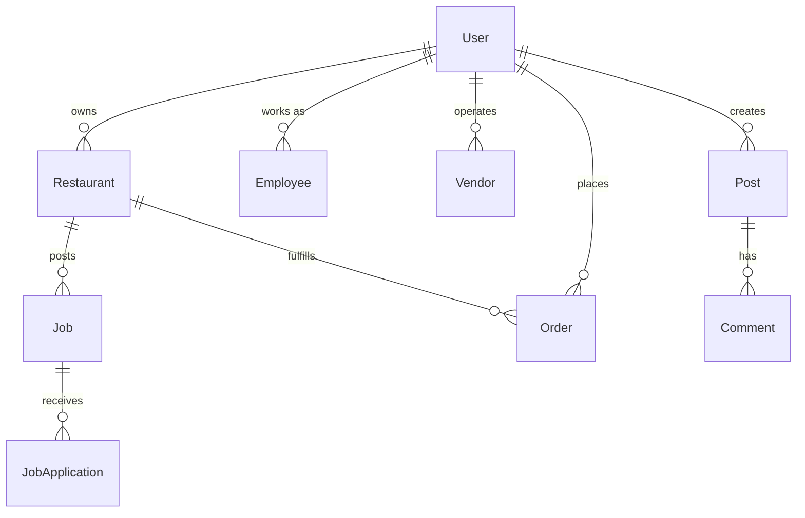

# RestoPapa System Architecture

This document provides a comprehensive overview of the RestoPapa platform architecture, design patterns, and technical decisions.

## 🏗️ High-Level Architecture

### System Overview

```
┌─────────────────────────────────────────────────────────────────────┐
│                            RestoPapa Platform                    │
├─────────────────────────────────────────────────────────────────────┤
│                          Presentation Layer                         │
├───────────────────┬─────────────────────┬───────────────────────────┤
│   Web Frontend    │    Admin Panel      │      API Documentation   │
│   (Next.js 14)    │   (React Admin)     │      (Swagger UI)        │
│   Port: 3000       │   Port: 3002        │      Port: 3001/docs     │
└───────────────────┴─────────────────────┴───────────────────────────┘
                                │
                         ┌─────────────┐
                         │   Load      │
                         │  Balancer   │
                         │  (Future)   │
                         └─────────────┘
                                │
├─────────────────────────────────────────────────────────────────────┤
│                          Application Layer                          │
├───────────────────┬─────────────────────┬───────────────────────────┤
│   API Gateway     │   Auth Service      │   Notification Service   │
│   (NestJS)        │   (NestJS)          │      (NestJS)            │
│   Port: 3001      │   Port: 3015        │      Port: 3017          │
├───────────────────┼─────────────────────┼───────────────────────────┤
│  Order Service    │ Restaurant Service  │     Analytics Service    │
│   (NestJS)        │     (NestJS)        │       (NestJS)           │
│   Port: 3016      │     Port: 3020      │       Port: 3018         │
└───────────────────┴─────────────────────┴───────────────────────────┘
                                │
├─────────────────────────────────────────────────────────────────────┤
│                           Data Layer                                │
├───────────────────┬─────────────────────┬───────────────────────────┤
│   PostgreSQL      │      Redis          │      File Storage        │
│   (Database)      │     (Cache)         │      (AWS S3)            │
│   Port: 5432      │    Port: 6379       │                          │
└───────────────────┴─────────────────────┴───────────────────────────┘
```

### Architecture Principles

1. **Microservices Architecture**: Loosely coupled, independently deployable services
2. **API-First Design**: Well-defined API contracts between services
3. **Event-Driven Architecture**: Asynchronous communication via events
4. **Domain-Driven Design**: Clear separation of business domains
5. **Scalability**: Horizontal scaling capabilities
6. **Security by Design**: Security considerations at every layer

## 🎯 Frontend Architecture

### Next.js Application Structure

```
apps/web/
├── app/                      # App Router (Next.js 13+)
│   ├── (auth)/              # Route groups
│   │   ├── login/
│   │   └── register/
│   ├── (dashboard)/         # Protected routes
│   │   ├── jobs/
│   │   ├── profile/
│   │   └── analytics/
│   ├── api/                 # API routes (Edge functions)
│   ├── globals.css          # Global styles
│   ├── layout.tsx           # Root layout
│   └── page.tsx             # Home page
├── components/              # Reusable components
│   ├── ui/                  # Base UI components
│   ├── forms/               # Form components
│   ├── layouts/             # Layout components
│   └── features/            # Feature-specific components
├── lib/                     # Utilities and configuration
│   ├── api/                 # API client functions
│   ├── hooks/               # Custom React hooks
│   ├── utils/               # Utility functions
│   └── validations/         # Form validation schemas
└── public/                  # Static assets
```

### Component Architecture

```typescript
// Component Hierarchy Example
App
├── RootLayout
│   ├── Header
│   │   ├── Navigation
│   │   ├── UserMenu
│   │   └── NotificationBell
│   ├── Sidebar (conditional)
│   │   ├── NavigationMenu
│   │   └── UserProfile
│   ├── MainContent
│   │   └── PageComponent
│   └── Footer
└── Providers
    ├── AuthProvider
    ├── ThemeProvider
    └── QueryProvider
```

### State Management Strategy

```typescript
// State Management Layers
┌─────────────────────────────────────────────┐
│                Server State                 │
│           (React Query/SWR)                 │
│  - API data caching                         │
│  - Background refetching                    │
│  - Optimistic updates                       │
└─────────────────────────────────────────────┘
┌─────────────────────────────────────────────┐
│               Client State                  │
│            (React Context)                  │
│  - Authentication state                     │
│  - UI state (modals, themes)                │
│  - Form state (React Hook Form)             │
└─────────────────────────────────────────────┘
┌─────────────────────────────────────────────┐
│                URL State                    │
│           (Next.js Router)                  │
│  - Route parameters                         │
│  - Search parameters                        │
│  - Navigation state                         │
└─────────────────────────────────────────────┘
```

## 🔧 Backend Architecture

### Microservices Design

#### 1. API Gateway Service
```typescript
// Primary API Gateway
apps/api/
├── src/
│   ├── modules/
│   │   ├── auth/           # Authentication endpoints
│   │   ├── users/          # User management
│   │   ├── jobs/           # Job management
│   │   ├── community/      # Community features
│   │   └── analytics/      # Analytics endpoints
│   ├── common/
│   │   ├── guards/         # Authentication guards
│   │   ├── interceptors/   # Request/response interceptors
│   │   ├── decorators/     # Custom decorators
│   │   └── filters/        # Exception filters
│   ├── config/             # Configuration
│   └── main.ts             # Application bootstrap
```

**Responsibilities:**
- Request routing and validation
- Authentication and authorization
- Rate limiting and security
- API documentation (Swagger)
- Request/response transformation

#### 2. Authentication Service
```typescript
apps/auth-service/
├── src/
│   ├── auth/
│   │   ├── strategies/     # Passport strategies
│   │   ├── guards/         # Custom guards
│   │   └── dto/           # Data transfer objects
│   ├── users/             # User management
│   ├── sessions/          # Session management
│   └── verification/      # Email/identity verification
```

**Responsibilities:**
- User authentication and authorization
- JWT token management
- Session handling
- Password reset and email verification
- Two-factor authentication

#### 3. Restaurant Service
```typescript
apps/restaurant-service/
├── src/
│   ├── restaurants/       # Restaurant profiles
│   ├── menus/            # Menu management
│   ├── orders/           # Order processing
│   ├── inventory/        # Inventory tracking
│   └── analytics/        # Restaurant analytics
```

**Responsibilities:**
- Restaurant profile management
- Menu and inventory management
- Order processing
- Staff management
- Business analytics

#### 4. Order Service
```typescript
apps/order-service/
├── src/
│   ├── orders/           # Order management
│   ├── payments/         # Payment processing
│   ├── notifications/    # Order notifications
│   └── fulfillment/     # Order fulfillment
```

**Responsibilities:**
- Order lifecycle management
- Payment processing integration
- Order status tracking
- Notification dispatch
- Fulfillment coordination

#### 5. Notification Service
```typescript
apps/notification-service/
├── src/
│   ├── email/            # Email notifications
│   ├── push/             # Push notifications
│   ├── sms/              # SMS notifications
│   └── templates/        # Notification templates
```

**Responsibilities:**
- Multi-channel notifications
- Template management
- Delivery tracking
- Preference management
- Analytics and reporting

### Service Communication

#### Synchronous Communication
```typescript
// HTTP REST API calls between services
interface ServiceClient {
  getUserProfile(userId: string): Promise<UserProfile>;
  getRestaurantDetails(restaurantId: string): Promise<Restaurant>;
  processPayment(paymentData: PaymentRequest): Promise<PaymentResult>;
}

// Service registry pattern
@Injectable()
export class ServiceRegistry {
  private services = new Map<string, ServiceClient>();

  register(serviceName: string, client: ServiceClient) {
    this.services.set(serviceName, client);
  }

  get(serviceName: string): ServiceClient {
    return this.services.get(serviceName);
  }
}
```

#### Asynchronous Communication
```typescript
// Event-driven architecture using Redis pub/sub
interface DomainEvent {
  eventType: string;
  aggregateId: string;
  timestamp: Date;
  payload: any;
}

@Injectable()
export class EventBus {
  async publish(event: DomainEvent): Promise<void> {
    await this.redis.publish(event.eventType, JSON.stringify(event));
  }

  async subscribe(eventType: string, handler: EventHandler): Promise<void> {
    await this.redis.subscribe(eventType);
    this.redis.on('message', (channel, message) => {
      if (channel === eventType) {
        handler(JSON.parse(message));
      }
    });
  }
}

// Example events
interface UserRegisteredEvent extends DomainEvent {
  eventType: 'user.registered';
  payload: {
    userId: string;
    email: string;
    role: UserRole;
  };
}

interface OrderCreatedEvent extends DomainEvent {
  eventType: 'order.created';
  payload: {
    orderId: string;
    restaurantId: string;
    customerId: string;
    total: number;
  };
}
```

## 🗄️ Database Architecture

### Data Model Design

#### Core Entities
```sql
-- User Management
User (id, email, role, profile_data)
├── Profile (user_id, firstName, lastName, avatar)
├── Session (user_id, token, expires_at)
└── UserPermissions (user_id, permission_set)

-- Restaurant Domain
Restaurant (id, user_id, name, verification_status)
├── Branch (restaurant_id, location, manager)
├── Employee (user_id, restaurant_id, position)
└── Menu (restaurant_id, items, categories)

-- Job Domain
Job (id, restaurant_id, title, description, status)
├── JobApplication (job_id, employee_id, status)
├── Interview (application_id, scheduled_at, notes)
└── Offer (application_id, salary, terms)

-- Order Domain
Order (id, restaurant_id, customer_id, total, status)
├── OrderItem (order_id, product_id, quantity, price)
├── Payment (order_id, amount, method, status)
└── Delivery (order_id, address, status, eta)

-- Community Domain
Post (id, user_id, content, category, visibility)
├── Comment (post_id, user_id, content)
├── Like (post_id, user_id)
└── Share (post_id, user_id, platform)
```

#### Database Relationships


### Data Access Patterns

#### Repository Pattern
```typescript
// Generic repository interface
interface Repository<T, ID> {
  findById(id: ID): Promise<T | null>;
  findAll(criteria?: any): Promise<T[]>;
  create(entity: Partial<T>): Promise<T>;
  update(id: ID, updates: Partial<T>): Promise<T>;
  delete(id: ID): Promise<void>;
}

// Prisma implementation
@Injectable()
export class UserRepository implements Repository<User, string> {
  constructor(private prisma: PrismaService) {}

  async findById(id: string): Promise<User | null> {
    return this.prisma.user.findUnique({
      where: { id },
      include: { profile: true }
    });
  }

  async findByEmail(email: string): Promise<User | null> {
    return this.prisma.user.findUnique({
      where: { email },
      include: { profile: true }
    });
  }

  // ... other methods
}
```

#### Query Optimization
```typescript
// Efficient data fetching strategies
class OptimizedQueries {
  // Use select to limit fields
  async getUserSummary(userId: string) {
    return this.prisma.user.findUnique({
      where: { id: userId },
      select: {
        id: true,
        email: true,
        profile: {
          select: {
            firstName: true,
            lastName: true,
            avatar: true
          }
        }
      }
    });
  }

  // Use pagination for large datasets
  async getJobsPaginated(page: number, limit: number) {
    const skip = (page - 1) * limit;

    const [jobs, total] = await Promise.all([
      this.prisma.job.findMany({
        skip,
        take: limit,
        include: {
          restaurant: {
            select: { name: true, logo: true }
          }
        },
        orderBy: { createdAt: 'desc' }
      }),
      this.prisma.job.count()
    ]);

    return {
      data: jobs,
      pagination: {
        page,
        limit,
        total,
        totalPages: Math.ceil(total / limit)
      }
    };
  }

  // Use transactions for data consistency
  async createJobWithApplication(jobData: any, applicationData: any) {
    return this.prisma.$transaction(async (tx) => {
      const job = await tx.job.create({ data: jobData });
      const application = await tx.jobApplication.create({
        data: { ...applicationData, jobId: job.id }
      });
      return { job, application };
    });
  }
}
```

## 🔐 Security Architecture

### Authentication & Authorization

#### JWT Token Strategy
```typescript
// JWT token structure
interface JWTPayload {
  sub: string;           // Subject (user ID)
  email: string;         // User email
  role: UserRole;        // User role
  permissions: string[]; // Specific permissions
  iat: number;          // Issued at
  exp: number;          // Expires at
  jti: string;          // JWT ID (for blacklisting)
}

// Token management service
@Injectable()
export class TokenService {
  async generateTokens(user: User): Promise<TokenPair> {
    const payload: JWTPayload = {
      sub: user.id,
      email: user.email,
      role: user.role,
      permissions: await this.getUserPermissions(user.id),
      iat: Math.floor(Date.now() / 1000),
      exp: Math.floor(Date.now() / 1000) + (15 * 60), // 15 minutes
      jti: uuidv4()
    };

    const accessToken = this.jwtService.sign(payload);
    const refreshToken = await this.generateRefreshToken(user.id);

    return { accessToken, refreshToken };
  }

  async blacklistToken(jti: string): Promise<void> {
    await this.redis.set(`blacklist:${jti}`, '1', 'EX', 15 * 60);
  }
}
```

#### Role-Based Access Control (RBAC)
```typescript
// Permission system
enum Permission {
  // User permissions
  USER_READ = 'user:read',
  USER_WRITE = 'user:write',
  USER_DELETE = 'user:delete',

  // Restaurant permissions
  RESTAURANT_CREATE = 'restaurant:create',
  RESTAURANT_MANAGE = 'restaurant:manage',
  RESTAURANT_ANALYTICS = 'restaurant:analytics',

  // Job permissions
  JOB_CREATE = 'job:create',
  JOB_APPLY = 'job:apply',
  JOB_MANAGE = 'job:manage',

  // Admin permissions
  ADMIN_USERS = 'admin:users',
  ADMIN_SYSTEM = 'admin:system',
  ADMIN_ANALYTICS = 'admin:analytics'
}

// Role definitions
const ROLE_PERMISSIONS = {
  [UserRole.ADMIN]: [
    Permission.USER_READ,
    Permission.USER_WRITE,
    Permission.USER_DELETE,
    Permission.ADMIN_USERS,
    Permission.ADMIN_SYSTEM,
    Permission.ADMIN_ANALYTICS
  ],
  [UserRole.RESTAURANT]: [
    Permission.USER_READ,
    Permission.USER_WRITE,
    Permission.RESTAURANT_CREATE,
    Permission.RESTAURANT_MANAGE,
    Permission.RESTAURANT_ANALYTICS,
    Permission.JOB_CREATE,
    Permission.JOB_MANAGE
  ],
  [UserRole.EMPLOYEE]: [
    Permission.USER_READ,
    Permission.USER_WRITE,
    Permission.JOB_APPLY
  ],
  [UserRole.VENDOR]: [
    Permission.USER_READ,
    Permission.USER_WRITE,
    Permission.RESTAURANT_CREATE
  ]
};

// Guard implementation
@Injectable()
export class PermissionGuard implements CanActivate {
  canActivate(context: ExecutionContext): boolean {
    const requiredPermissions = this.reflector.get<Permission[]>(
      'permissions',
      context.getHandler()
    );

    if (!requiredPermissions) {
      return true;
    }

    const request = context.switchToHttp().getRequest();
    const user = request.user;

    return requiredPermissions.every(permission =>
      user.permissions.includes(permission)
    );
  }
}
```

### Data Security

#### Input Validation
```typescript
// DTO validation with class-validator
export class CreateJobDto {
  @IsString()
  @MinLength(3)
  @MaxLength(100)
  title: string;

  @IsString()
  @MinLength(10)
  @MaxLength(5000)
  description: string;

  @IsArray()
  @ArrayMinSize(1)
  @IsString({ each: true })
  requirements: string[];

  @IsNumber()
  @Min(0)
  @Max(50)
  experienceMin: number;

  @IsOptional()
  @IsNumber()
  @Min(0)
  experienceMax?: number;

  @Transform(({ value }) => sanitizeHtml(value))
  @IsString()
  location: string;
}

// Custom validation pipe
@Injectable()
export class CustomValidationPipe extends ValidationPipe {
  async transform(value: any, metadata: ArgumentMetadata) {
    // Sanitize input
    if (typeof value === 'string') {
      value = sanitizeHtml(value);
    }

    // Apply validation
    return super.transform(value, metadata);
  }
}
```

#### Data Encryption
```typescript
// Sensitive data encryption
@Injectable()
export class EncryptionService {
  private readonly algorithm = 'aes-256-gcm';
  private readonly secretKey = process.env.ENCRYPTION_KEY;

  encrypt(text: string): string {
    const iv = crypto.randomBytes(16);
    const cipher = crypto.createCipher(this.algorithm, this.secretKey);
    cipher.setAAD(Buffer.from('additional-data'));

    let encrypted = cipher.update(text, 'utf8', 'hex');
    encrypted += cipher.final('hex');

    const authTag = cipher.getAuthTag();

    return `${iv.toString('hex')}:${authTag.toString('hex')}:${encrypted}`;
  }

  decrypt(encryptedText: string): string {
    const [ivHex, authTagHex, encrypted] = encryptedText.split(':');

    const iv = Buffer.from(ivHex, 'hex');
    const authTag = Buffer.from(authTagHex, 'hex');

    const decipher = crypto.createDecipher(this.algorithm, this.secretKey);
    decipher.setAAD(Buffer.from('additional-data'));
    decipher.setAuthTag(authTag);

    let decrypted = decipher.update(encrypted, 'hex', 'utf8');
    decrypted += decipher.final('utf8');

    return decrypted;
  }
}
```

## 📊 Caching Strategy

### Multi-Level Caching

```typescript
// Cache abstraction layer
interface CacheManager {
  get<T>(key: string): Promise<T | null>;
  set<T>(key: string, value: T, ttl?: number): Promise<void>;
  delete(key: string): Promise<void>;
  clear(): Promise<void>;
}

// Redis cache implementation
@Injectable()
export class RedisCache implements CacheManager {
  constructor(private redis: Redis) {}

  async get<T>(key: string): Promise<T | null> {
    const value = await this.redis.get(key);
    return value ? JSON.parse(value) : null;
  }

  async set<T>(key: string, value: T, ttl = 3600): Promise<void> {
    await this.redis.setex(key, ttl, JSON.stringify(value));
  }

  async delete(key: string): Promise<void> {
    await this.redis.del(key);
  }
}

// Cache decorator
export function Cacheable(ttl = 3600) {
  return function (target: any, propertyName: string, descriptor: PropertyDescriptor) {
    const method = descriptor.value;

    descriptor.value = async function (...args: any[]) {
      const cacheKey = `${target.constructor.name}:${propertyName}:${JSON.stringify(args)}`;

      // Try to get from cache
      let result = await this.cache.get(cacheKey);

      if (!result) {
        // Execute method and cache result
        result = await method.apply(this, args);
        await this.cache.set(cacheKey, result, ttl);
      }

      return result;
    };
  };
}

// Usage example
@Injectable()
export class JobService {
  constructor(private cache: CacheManager) {}

  @Cacheable(600) // Cache for 10 minutes
  async getPopularJobs(): Promise<Job[]> {
    return this.jobRepository.findMany({
      where: { status: JobStatus.OPEN },
      orderBy: { viewCount: 'desc' },
      take: 20
    });
  }
}
```

### Cache Invalidation Strategy

```typescript
// Event-driven cache invalidation
@Injectable()
export class CacheInvalidationService {
  constructor(
    private cache: CacheManager,
    private eventBus: EventBus
  ) {
    this.setupEventHandlers();
  }

  private setupEventHandlers() {
    this.eventBus.subscribe('job.created', (event) => {
      this.invalidateJobCaches();
    });

    this.eventBus.subscribe('user.updated', (event) => {
      this.invalidateUserCache(event.payload.userId);
    });
  }

  private async invalidateJobCaches() {
    const patterns = [
      'JobService:getPopularJobs:*',
      'JobService:searchJobs:*',
      'JobService:getJobsByCategory:*'
    ];

    for (const pattern of patterns) {
      await this.cache.deletePattern(pattern);
    }
  }

  private async invalidateUserCache(userId: string) {
    await this.cache.delete(`user:${userId}`);
    await this.cache.delete(`user:profile:${userId}`);
  }
}
```

## 🔄 API Design Patterns

### RESTful API Design

```typescript
// Resource-based URL structure
/api/v1/users                    # GET, POST
/api/v1/users/{id}              # GET, PUT, DELETE
/api/v1/users/{id}/profile      # GET, PUT
/api/v1/users/{id}/jobs         # GET (jobs applied by user)

/api/v1/restaurants             # GET, POST
/api/v1/restaurants/{id}        # GET, PUT, DELETE
/api/v1/restaurants/{id}/jobs   # GET, POST
/api/v1/restaurants/{id}/analytics # GET

/api/v1/jobs                    # GET, POST
/api/v1/jobs/{id}              # GET, PUT, DELETE
/api/v1/jobs/{id}/applications # GET, POST
/api/v1/jobs/search            # GET

// Response format standardization
interface ApiResponse<T> {
  success: boolean;
  data?: T;
  error?: {
    code: string;
    message: string;
    details?: any;
  };
  pagination?: {
    page: number;
    limit: number;
    total: number;
    totalPages: number;
  };
  meta?: {
    timestamp: string;
    version: string;
    requestId: string;
  };
}

// Error handling middleware
@Catch()
export class GlobalExceptionFilter implements ExceptionFilter {
  catch(exception: unknown, host: ArgumentsHost) {
    const ctx = host.switchToHttp();
    const response = ctx.getResponse();
    const request = ctx.getRequest();

    let status = 500;
    let message = 'Internal server error';
    let code = 'INTERNAL_ERROR';

    if (exception instanceof HttpException) {
      status = exception.getStatus();
      const exceptionResponse = exception.getResponse();

      if (typeof exceptionResponse === 'string') {
        message = exceptionResponse;
      } else if (typeof exceptionResponse === 'object') {
        message = (exceptionResponse as any).message || message;
        code = (exceptionResponse as any).code || code;
      }
    }

    const errorResponse: ApiResponse<null> = {
      success: false,
      error: {
        code,
        message,
      },
      meta: {
        timestamp: new Date().toISOString(),
        version: process.env.API_VERSION || '1.0.0',
        requestId: request.id
      }
    };

    response.status(status).json(errorResponse);
  }
}
```

### GraphQL Integration (Future)

```typescript
// GraphQL schema design for complex queries
type Query {
  # User queries
  user(id: ID!): User
  users(filter: UserFilter, pagination: PaginationInput): UserConnection

  # Job queries
  job(id: ID!): Job
  jobs(filter: JobFilter, pagination: PaginationInput): JobConnection
  searchJobs(query: String!, filters: JobSearchFilter): [Job!]!

  # Restaurant queries
  restaurant(id: ID!): Restaurant
  restaurants(filter: RestaurantFilter): [Restaurant!]!
}

type Mutation {
  # User mutations
  createUser(input: CreateUserInput!): User!
  updateUser(id: ID!, input: UpdateUserInput!): User!

  # Job mutations
  createJob(input: CreateJobInput!): Job!
  applyToJob(jobId: ID!, applicationData: JobApplicationInput!): JobApplication!

  # Restaurant mutations
  createRestaurant(input: CreateRestaurantInput!): Restaurant!
}

type Subscription {
  # Real-time updates
  jobApplicationUpdated(userId: ID!): JobApplication!
  newJobPosted(filters: JobFilter): Job!
  orderStatusChanged(orderId: ID!): Order!
}
```

## 📈 Performance Optimization

### Database Optimization

```typescript
// Query optimization strategies
class PerformanceOptimizations {
  // Use database indexes effectively
  async createIndexes() {
    // Composite indexes for common queries
    await this.prisma.$executeRaw`
      CREATE INDEX CONCURRENTLY idx_jobs_search
      ON jobs (status, location, job_type, created_at DESC)
    `;

    await this.prisma.$executeRaw`
      CREATE INDEX CONCURRENTLY idx_users_role_active
      ON users (role, is_active, created_at DESC)
    `;
  }

  // Implement read replicas for scaling
  async getJobsFromReadReplica(filters: any) {
    return this.readOnlyPrisma.job.findMany({
      where: filters,
      include: {
        restaurant: {
          select: { name: true, logo: true }
        }
      }
    });
  }

  // Use connection pooling
  private createDatabaseConnection() {
    return new PrismaClient({
      datasources: {
        db: {
          url: process.env.DATABASE_URL,
        },
      },
      log: ['query', 'info', 'warn', 'error'],
    });
  }
}
```

### Application Performance

```typescript
// Background job processing
@Injectable()
export class JobQueue {
  private queue: Queue;

  constructor() {
    this.queue = new Bull('job-queue', {
      redis: {
        host: process.env.REDIS_HOST,
        port: parseInt(process.env.REDIS_PORT),
      },
    });

    this.setupProcessors();
  }

  private setupProcessors() {
    // Email processing
    this.queue.process('send-email', 10, async (job) => {
      const { to, subject, template, data } = job.data;
      await this.emailService.sendEmail(to, subject, template, data);
    });

    // Analytics processing
    this.queue.process('update-analytics', 5, async (job) => {
      const { entityType, entityId, metrics } = job.data;
      await this.analyticsService.updateMetrics(entityType, entityId, metrics);
    });
  }

  async addEmailJob(emailData: any) {
    await this.queue.add('send-email', emailData, {
      delay: 1000, // 1 second delay
      attempts: 3,
      backoff: 'exponential',
    });
  }
}
```

## 🔍 Monitoring and Observability

### Application Metrics

```typescript
// Prometheus metrics integration
@Injectable()
export class MetricsService {
  private httpRequestDuration = new Histogram({
    name: 'http_request_duration_seconds',
    help: 'Duration of HTTP requests in seconds',
    labelNames: ['method', 'route', 'status_code'],
    buckets: [0.1, 0.5, 1, 2, 5, 10],
  });

  private httpRequestTotal = new Counter({
    name: 'http_requests_total',
    help: 'Total number of HTTP requests',
    labelNames: ['method', 'route', 'status_code'],
  });

  private activeUsers = new Gauge({
    name: 'active_users_total',
    help: 'Number of currently active users',
  });

  recordHttpRequest(method: string, route: string, statusCode: number, duration: number) {
    this.httpRequestDuration
      .labels(method, route, statusCode.toString())
      .observe(duration);

    this.httpRequestTotal
      .labels(method, route, statusCode.toString())
      .inc();
  }

  updateActiveUsers(count: number) {
    this.activeUsers.set(count);
  }
}

// Metrics middleware
@Injectable()
export class MetricsMiddleware implements NestMiddleware {
  constructor(private metricsService: MetricsService) {}

  use(req: Request, res: Response, next: NextFunction) {
    const start = Date.now();

    res.on('finish', () => {
      const duration = (Date.now() - start) / 1000;
      this.metricsService.recordHttpRequest(
        req.method,
        req.route?.path || req.path,
        res.statusCode,
        duration
      );
    });

    next();
  }
}
```

### Health Checks

```typescript
// Comprehensive health checks
@Injectable()
export class HealthService {
  constructor(
    private prisma: PrismaService,
    private redis: Redis,
    private httpService: HttpService
  ) {}

  async checkDatabase(): Promise<HealthIndicator> {
    try {
      await this.prisma.$queryRaw`SELECT 1`;
      return {
        database: {
          status: 'up',
          responseTime: await this.measureDbResponseTime(),
        },
      };
    } catch (error) {
      return {
        database: {
          status: 'down',
          error: error.message,
        },
      };
    }
  }

  async checkRedis(): Promise<HealthIndicator> {
    try {
      const start = Date.now();
      await this.redis.ping();
      const responseTime = Date.now() - start;

      return {
        redis: {
          status: 'up',
          responseTime,
        },
      };
    } catch (error) {
      return {
        redis: {
          status: 'down',
          error: error.message,
        },
      };
    }
  }

  async checkExternalServices(): Promise<HealthIndicator> {
    const services = [
      { name: 'payment-gateway', url: process.env.PAYMENT_GATEWAY_URL },
      { name: 'email-service', url: process.env.EMAIL_SERVICE_URL },
    ];

    const results = await Promise.allSettled(
      services.map(async (service) => {
        const start = Date.now();
        await this.httpService.get(`${service.url}/health`).toPromise();
        return {
          [service.name]: {
            status: 'up',
            responseTime: Date.now() - start,
          },
        };
      })
    );

    return results.reduce((acc, result, index) => {
      if (result.status === 'fulfilled') {
        return { ...acc, ...result.value };
      } else {
        return {
          ...acc,
          [services[index].name]: {
            status: 'down',
            error: result.reason?.message,
          },
        };
      }
    }, {});
  }
}
```

## 🚀 Deployment Architecture

### Container Strategy

```dockerfile
# Multi-stage Docker build
FROM node:18-alpine AS base
WORKDIR /app
COPY package*.json ./
RUN npm ci --only=production

FROM node:18-alpine AS build
WORKDIR /app
COPY package*.json ./
RUN npm ci
COPY . .
RUN npm run build

FROM node:18-alpine AS production
WORKDIR /app
COPY --from=base /app/node_modules ./node_modules
COPY --from=build /app/dist ./dist
COPY --from=build /app/package*.json ./

EXPOSE 3001
CMD ["node", "dist/main.js"]
```

### Kubernetes Deployment

```yaml
# Kubernetes deployment configuration
apiVersion: apps/v1
kind: Deployment
metadata:
  name: restopapa-api
spec:
  replicas: 3
  selector:
    matchLabels:
      app: restopapa-api
  template:
    metadata:
      labels:
        app: restopapa-api
    spec:
      containers:
      - name: api
        image: restopapa/api:latest
        ports:
        - containerPort: 3001
        env:
        - name: DATABASE_URL
          valueFrom:
            secretKeyRef:
              name: db-credentials
              key: url
        - name: REDIS_URL
          valueFrom:
            secretKeyRef:
              name: redis-credentials
              key: url
        resources:
          requests:
            memory: "256Mi"
            cpu: "250m"
          limits:
            memory: "512Mi"
            cpu: "500m"
        livenessProbe:
          httpGet:
            path: /health
            port: 3001
          initialDelaySeconds: 30
          periodSeconds: 10
        readinessProbe:
          httpGet:
            path: /health/ready
            port: 3001
          initialDelaySeconds: 5
          periodSeconds: 5
```

### Load Balancing

```yaml
# Nginx load balancer configuration
upstream restopapa_api {
    least_conn;
    server api-1:3001 max_fails=3 fail_timeout=30s;
    server api-2:3001 max_fails=3 fail_timeout=30s;
    server api-3:3001 max_fails=3 fail_timeout=30s;
}

server {
    listen 80;
    server_name api.restopapa.com;

    location / {
        proxy_pass http://restopapa_api;
        proxy_set_header Host $host;
        proxy_set_header X-Real-IP $remote_addr;
        proxy_set_header X-Forwarded-For $proxy_add_x_forwarded_for;
        proxy_set_header X-Forwarded-Proto $scheme;

        # Enable proxy buffering
        proxy_buffering on;
        proxy_buffer_size 128k;
        proxy_buffers 4 256k;
        proxy_busy_buffers_size 256k;

        # Timeouts
        proxy_connect_timeout 60s;
        proxy_send_timeout 60s;
        proxy_read_timeout 60s;
    }

    # Health check endpoint
    location /health {
        access_log off;
        proxy_pass http://restopapa_api;
    }
}
```

## 📚 Design Patterns and Best Practices

### Domain-Driven Design

```typescript
// Value objects
export class Email {
  private constructor(private readonly value: string) {
    if (!this.isValid(value)) {
      throw new Error('Invalid email format');
    }
  }

  static create(email: string): Email {
    return new Email(email);
  }

  getValue(): string {
    return this.value;
  }

  private isValid(email: string): boolean {
    const emailRegex = /^[^\s@]+@[^\s@]+\.[^\s@]+$/;
    return emailRegex.test(email);
  }
}

// Entities
export class Job {
  private constructor(
    private readonly id: JobId,
    private title: string,
    private description: string,
    private status: JobStatus,
    private readonly createdAt: Date
  ) {}

  static create(data: CreateJobData): Job {
    const id = JobId.generate();
    const job = new Job(
      id,
      data.title,
      data.description,
      JobStatus.DRAFT,
      new Date()
    );

    // Emit domain event
    DomainEvents.raise(new JobCreatedEvent(job));

    return job;
  }

  publish(): void {
    if (this.status !== JobStatus.DRAFT) {
      throw new Error('Only draft jobs can be published');
    }

    this.status = JobStatus.OPEN;
    DomainEvents.raise(new JobPublishedEvent(this));
  }

  getId(): JobId {
    return this.id;
  }

  getTitle(): string {
    return this.title;
  }
}

// Aggregates
export class Restaurant {
  private constructor(
    private readonly id: RestaurantId,
    private profile: RestaurantProfile,
    private jobs: Job[],
    private employees: Employee[]
  ) {}

  postJob(jobData: CreateJobData): Job {
    if (!this.isVerified()) {
      throw new Error('Restaurant must be verified to post jobs');
    }

    const job = Job.create({
      ...jobData,
      restaurantId: this.id
    });

    this.jobs.push(job);

    return job;
  }

  hireEmployee(applicationId: ApplicationId): void {
    const application = this.findApplication(applicationId);

    if (!application) {
      throw new Error('Application not found');
    }

    application.accept();

    const employee = Employee.create({
      userId: application.getApplicantId(),
      restaurantId: this.id,
      position: application.getJob().getTitle()
    });

    this.employees.push(employee);

    DomainEvents.raise(new EmployeeHiredEvent(employee));
  }
}
```

### CQRS Pattern

```typescript
// Command side
export interface Command {
  readonly type: string;
}

export class CreateJobCommand implements Command {
  readonly type = 'CREATE_JOB';

  constructor(
    public readonly restaurantId: string,
    public readonly jobData: CreateJobData
  ) {}
}

export class CommandHandler<T extends Command> {
  abstract handle(command: T): Promise<void>;
}

@Injectable()
export class CreateJobCommandHandler extends CommandHandler<CreateJobCommand> {
  constructor(
    private jobRepository: JobRepository,
    private eventBus: EventBus
  ) {
    super();
  }

  async handle(command: CreateJobCommand): Promise<void> {
    const restaurant = await this.restaurantRepository.findById(
      command.restaurantId
    );

    if (!restaurant) {
      throw new Error('Restaurant not found');
    }

    const job = restaurant.postJob(command.jobData);

    await this.jobRepository.save(job);

    // Publish events
    const events = restaurant.getUncommittedEvents();
    for (const event of events) {
      await this.eventBus.publish(event);
    }

    restaurant.markEventsAsCommitted();
  }
}

// Query side
export interface Query {
  readonly type: string;
}

export class GetJobsQuery implements Query {
  readonly type = 'GET_JOBS';

  constructor(
    public readonly filters: JobFilters,
    public readonly pagination: PaginationOptions
  ) {}
}

@Injectable()
export class GetJobsQueryHandler {
  constructor(private jobReadModel: JobReadModel) {}

  async handle(query: GetJobsQuery): Promise<JobListResult> {
    return this.jobReadModel.findJobs(query.filters, query.pagination);
  }
}
```

### Event Sourcing (Future Enhancement)

```typescript
// Event store interface
export interface EventStore {
  saveEvents(aggregateId: string, events: DomainEvent[], expectedVersion: number): Promise<void>;
  getEvents(aggregateId: string, fromVersion?: number): Promise<DomainEvent[]>;
}

// Aggregate base class with event sourcing
export abstract class EventSourcedAggregate {
  private _id: string;
  private _version: number = 0;
  private _uncommittedEvents: DomainEvent[] = [];

  protected constructor(id: string) {
    this._id = id;
  }

  protected addEvent(event: DomainEvent): void {
    this._uncommittedEvents.push(event);
    this.apply(event);
  }

  protected abstract apply(event: DomainEvent): void;

  getUncommittedEvents(): DomainEvent[] {
    return this._uncommittedEvents;
  }

  markEventsAsCommitted(): void {
    this._uncommittedEvents = [];
  }

  static fromHistory<T extends EventSourcedAggregate>(
    constructor: new (id: string) => T,
    id: string,
    events: DomainEvent[]
  ): T {
    const aggregate = new constructor(id);

    for (const event of events) {
      aggregate.apply(event);
      aggregate._version++;
    }

    return aggregate;
  }
}
```

This architecture document provides a comprehensive overview of the RestoPapa system design, covering all major architectural decisions, patterns, and best practices. The modular, scalable design ensures the platform can grow and adapt to changing requirements while maintaining high performance and security standards.